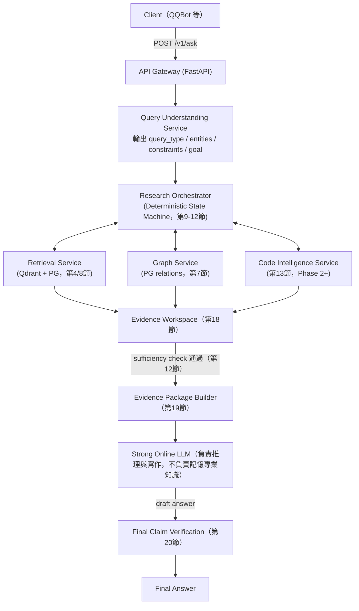

[索引](README.md) ｜ （本篇是第一篇） ｜ [PostgreSQL Schema →](01-postgres-schema.md)

---

# 特定領域 AI 專家化系統 開發計畫

## 0. 定位與範圍

本文件規劃一個**獨立系統**（暫名 `corrobora`），與 OpenST-QQBot 是不同 repository、不同技術棧、不同開發節奏：

| 項目 | OpenST-QQBot（現有） | corrobora（本計畫） |
| --- | --- | --- |
| 技術棧 | Node.js / TypeScript | Python / FastAPI |
| 資料 | CSV / JSON | PostgreSQL + Qdrant |
| 角色 | QQ 平台 adapter、使用者互動 | 領域知識檢索與推理後端 |
| 關係 | 未來作為 **client**，呼叫本系統 `POST /v1/ask`（正式 API，舊 `/answer` 僅視為 legacy adapter） | 提供 Evidence Package 或最終答案 |

驗證領域：Minecraft Technical / 生電（Redstone Tech）。所有 schema 與模組命名刻意保持領域中立（`concepts`、`mechanisms` 而非 `blocks`、`redstone_devices`），使日後可替換領域語料而不改架構。

不做的事寫在第 21 節，先讀那節可以避免規劃膨脹。

### 0.1 一句話心智模型

如果只能記住一句話：**PostgreSQL 是圖書館真正的館藏（每本書、每筆資料都編了目、審核過、找得到出處），Qdrant 只是一份「憑感覺猜你想找哪本書」的快速索引卡；Agent 是一個按規定流程做研究的館員，不是一個想到哪查到哪的自由讀者；LLM 只有在館員把資料整理好、按規定格式交出研究筆記之後，才負責寫出最後的分析報告，而不是自己憑印象回答**。

後面每一節的設計原則，幾乎都能拆解回這句話：
- 「Qdrant 只是 candidate index，可以從 PG 重建」→ 索引卡弄丟了没关系，館藏（PostgreSQL）還在。
- 「Candidate Claim 要人工審核才能變成 Verified Claim」→ 新書要先編目審核，才能上架讓讀者借閱，不能有人隨手塞一本書進書架就算數。
- 「Deterministic State Machine 而非自由 Agent」→ 館員按借閱規則做事（先查目錄、找不到才擴大範圍搜尋），不是想查什麼就查什麼。
- 「Evidence Package 分開 verified/candidate」→ 研究筆記要註明哪些是查證過的事實、哪些只是還沒證實的猜測，不能混在一起讓看報告的人分不清楚。

### 0.2 如何閱讀本文件

本文件同時給工程團隊實作參考（含 SQL/Python 等可執行層級的細節）與給人閱讀理解設計動機，因此每個複雜設計旁邊都會有一段「**白話說**」的框，用大白話+比喻重講一次「為什麼要這樣設計」，不想看 SQL/程式碼細節的讀者可以只看這些框和每節開頭的敘述段落，跳過程式碼區塊也不會斷掉理解脈絡。文中出現「v2 修正」字樣的地方，代表這是根據工程團隊審閱後修正過的設計，保留修正說明是為了讓未來的人知道「為什麼不是更直覺的那個寫法」，不是文件寫壞了忘記刪除。

---

## 1. 整體架構

**白話說**：一次問答的請求進來後，不是「查資料→丟給 LLM→回答」三步結束，而是先經過一個會判斷「這是什麼類型的問題」的前置分類，再交給一個像專案經理一樣的 Orchestrator 反覆調度檢索/圖譜/程式碼三個下游服務，直到湊齊足夠證據，才整理成一份結構化報告（Evidence Package）交給真正負責寫長篇分析的 LLM，LLM 寫完之後答案還要被拆解回頭核對一次才能真的送出去。下圖的每一條線都對應後面某一節的詳細規格：



圖裡的雙向箭頭（Orchestrator ↔ 三個下游服務）是重點：這不是一條單向的資料管線，Orchestrator 會反覆呼叫這三個服務很多輪（第11節的 Multi-hop Loop），直到證據夠了才往下走，不是查一次就結束。

支撐服務（背景執行，不在單次問答的 critical path）：

- **Ingestion Service**：原始資料 → Candidate Claim/Concept
- **Review Service**：人工審核介面 + API
- **Code Indexing Service**：離線建立 AST/Symbol/Call Graph
- **Small Domain Model Service**：本地推論（分類/路由/抽取）
- **Training Pipeline**：CPT / LoRA / SFT（離線，第 14-15 節）

---

## 2. Repository / 模組切分

單一 monorepo，Python 為主，poetry/uv 管理，每個 service 可獨立部署。狀態標記：`[MVP]` 首批實作、`[Phase 1]` 檢索強化、`[Phase 2]` 程式碼智能、`[Future]` 進階／訓練：

```text
corrobora/
├── pyproject.toml
├── docker-compose.yml                 # postgres, qdrant, api 一鍵起本地環境
├── services/
│   ├── gateway/                       # [MVP] FastAPI 入口，路由到各 service
│   │   ├── main.py
│   │   └── routers/{ask,review,ingest}.py
│   ├── query_understanding/           # [MVP]
│   │   ├── classifier.py              # query_type 分類（小模型或規則+LLM）
│   │   └── entity_linker.py           # alias -> concept_id
│   ├── orchestrator/                  # [MVP 簡版，Phase 1 完整]
│   │   ├── state_machine.py           # 第11節
│   │   ├── research_state.py          # 第9節 Pydantic model
│   │   └── stop_conditions.py         # 第12節
│   ├── retrieval/                     # [MVP dense-only，Phase 1 hybrid]
│   │   ├── dense.py / sparse.py / fusion.py / reranker.py
│   │   └── qdrant_client.py
│   ├── graph/                         # [MVP 簡版，Phase 1 完整]
│   │   ├── relations.py               # PG relations CRUD
│   │   └── traversal.py               # find_path, expand
│   ├── code_intel/                    # [Phase 2]
│   │   ├── indexer/{treesitter,jdt,scip}.py
│   │   ├── mc_semantic_layer.py       # 第14節
│   │   └── query.py                   # get_callers 等
│   ├── claims/                        # [MVP]
│   │   ├── extraction.py              # AI 抽取 candidate claim
│   │   ├── review.py                  # workflow
│   │   └── verification.py            # deterministic check
│   ├── evidence/                      # [MVP]
│   │   ├── workspace.py               # 第18節
│   │   └── package.py                 # 第19節
│   ├── tools/                         # [MVP] Agent 高階 tool，第10節
│   │   └── registry.py
│   └── domain_model/                  # [Future] Advanced 訓練／推論
│       ├── inference.py               # 本地小模型 serving（vLLM/SGLang client）
│       └── training/{cpt,sft,lora}.py
├── db/                                # [MVP]
│   ├── migrations/                    # alembic
│   └── schema.sql
├── ingestion/                         # [MVP]
│   ├── parsers/{markdown,csv,json,litematic}.py
│   └── pipelines/{document,machine,dictionary}.py
├── benchmark/                         # [MVP smoke]
│   ├── gold_dataset/
│   ├── eval_retriever.py
│   ├── eval_agent.py
│   └── eval_answer.py
└── tests/                             # [MVP]
```

> **註（與第 9 節 / 01-schema 銜接）**：`ResearchState` 需持久化到 PostgreSQL（預定 `research_sessions`、`research_events`、`tool_calls`），完整 DDL 留待 `01-postgres-schema.md` 補上，本篇不另行定義，避免兩邊各寫一套。

---

