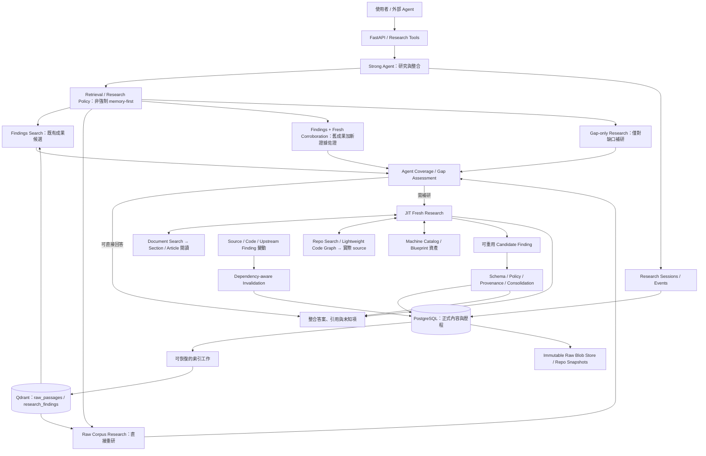

[計畫索引](README.md) · [資料模型 →](01-postgres-schema.md)

# corrobora：專業研究記憶與資料基礎設施

> 討論稿，2026-09-11。這是一份專案啟動前的設計計畫，描述建議方向、取捨與驗證方法，
> 不是已完成的系統，也不是已接受的 ADR。實際 repository 狀態見[盤點與遷移](10-current-state-and-migrations.md)。

## 1. 我們要解決什麼問題？

**為強通用 Agent 建立 Domain Research Infrastructure / Agentic Research Memory。**

Agent 已能讀大型程式庫、追蹤方法、比較執行路徑、理解長文，甚至從機制反向提出設計。
因此，研究重點不再是教模型理解 Minecraft，或自行建造完整 code reasoner。
真正需要累積的是：私人資料的索引、曾經花費研究成本得到的結論、結論的來源與適用範圍，
以及資料變動後哪些結論必須重新查證。

本系統不是訓練一個固定的領域專家模型，而是建立來源可追溯、版本化、可重現的研究基礎設施。
持久化的 Findings 只是其中一種重用機制，是否省成本又不降品質，需經基線對照與消融實驗驗證，
不預設 memory-first 最優。Agent 可走檢索／研究策略的多條路徑：直接沿用既有 Findings、
直接研究原始 corpus、Findings 加新證據佐證後再用，或僅在缺口處補研；高價值研究成果經
provenance 綁定、consolidation 與 version/dependency 管理後才寫入 Research Memory，
來源變動時進入重新驗證狀態。此處若沿用 non-parametric continual domain learning 一詞，
一律指待驗證假說／歷史用語，不代表已實現持續學習。

第一個驗證領域是 Minecraft Technical／生電。模組邊界盡量領域中立；版本、mapping、
機器結構等具體知識仍由 Minecraft adapter 表達，不為尚未出現的領域預建 ontology。

## 2. 分工：Agent 做研究，系統維護研究資產

| Strong Agent | corrobora |
| --- | --- |
| 理解問題、拆子問題、提出與修正 hypothesis | 提供可搜尋的 corpus、Findings 與版本範圍 |
| 自主選擇查詢、文章、symbol 與 code path | 工具存取、来源權限、预算、超時與取消 |
| 閱讀完整上下文、比較矛盾、跨來源推理 | immutable raw、精確引用、依賴、研究事件 |
| 從 mechanism 提出新設計、整合答案 | 寫入驗證、consolidation、invalidation 與評估 |

**控制資料與寫入的邊界，不預先規定每一步思考。**
不要求 hypothesis 必須先對上完整概念庫，不以固定 query template 限制發散；
但 Agent 不能自己把推論標成 `verified`、改寫既有 verified 內容、刪 source 或改 provenance。

白話說：Agent 是研究員；corrobora 是有目錄、研究筆記、版本標籤與查證紀錄的研究室。
研究員可以自由閱讀與推理，但不能把自己的草稿偷偷改成已審核的館藏。

## 3. 架構圖



圖中的 gap assessment 是 Agent 可修正的研究紀錄，不是額外訓練的必備分類模型。
檢索回傳候選後必須回 PostgreSQL 讀取有效狀態與權限；Qdrant payload 不決定真偽。
檢索／研究策略不強制 memory-first，四條路徑（findings 沿用、原始重研、加佐證重用、僅補缺口）
由 Agent 依 coverage 與成本選擇，並在評估中與無記憶基線對照。
研究可以產生答案但不保存 Finding；保存失敗也不等於答案必須失敗，回應須分別報告兩者結果。

## 4. 三種不同的資料資產

| 資產 | 做多少預處理 | 存在的價值 |
| --- | --- | --- |
| Documents | 原文快照、結構切段、metadata、術語、dense + lexical/sparse、rerank | 從未整理 corpus 找到值得閱讀的位置 |
| Code | 版本化 repository、檔案／symbol index、可可靠取得的輕量邊 | 告訴 Agent 去哪裡找；實際 code 才是 implementation 依據 |
| Research Findings | 只保存高 utility 結論，附來源、條件、依賴與查證狀態 | 避免跨 session 反覆付出相同研究成本 |

Blueprint／machine catalog 回答「人類做過哪些結構」，與「機制是什麼」互補。
目前有 81 筆目錄記錄，但本工作區未找到實體 `.litematic`，不能當成已有完整藍圖庫。

## 5. 延續既有合理設計，收斂不必要的部分

保留 Python 3.12、FastAPI、Pydantic、PostgreSQL、Qdrant，以及原始版本、來源政策、
中英術語、精確引用、測試 fixture 的基礎。舊文件已區分 code facts 與人類解釋，也已主張
Qdrant 可重建、PG relations 優先於 Neo4j；這些與新方向一致。

需要重新定位的是 Claim-first ingestion、固定狀態機、先收集 Evidence Package 再讓強模型
寫答案的分工，以及預排 Tree-sitter → JDT → SCIP → CodeQL 的技術路線。
這些項目多數仍是規劃，並非已有 production code，應直接修改建置方向，避免先實作再包裝。

新預設為 **單一 Python modular monolith + 背景 worker**。模組不是獨立 microservices：

```text
src/corrobora/                 # 建議結構，目前尚未建立
├─ api/                       # ask、research tools、寫入與管理邊界
├─ research/                  # Agent adapter、budget、session recorder
├─ memory/                    # Finding、coverage record、consolidation、invalidation
├─ corpus/                    # source policy、capture、parser、sections/passages
├─ retrieval/                 # encoder ports、fusion、reranker、context expansion
├─ code/                      # repo snapshots、symbol navigation、diff
├─ machines/                  # catalog、之後的 blueprint adapter
├─ storage/                   # PostgreSQL、blob store、Qdrant adapters
└─ jobs/                      # ingestion、index outbox、revalidation 排程
```

以 PostgreSQL transaction 管理核心寫入，慢速 LLM 呼叫與 embedding 在 transaction 外執行。
先用 PG 工作佇列與有界 worker；不預設 Kafka、Neo4j、多模型 serving 或複雜分散式協調。
瓶頸量測後才拆部署；外部 Agent 可直接使用 research tools，`POST /v1/ask` 是便利入口，
不是強制所有研究都由自製 Agent runtime 啟動。

## 6. 如何知道這個方向有價值？

核心主張必須同時符合：

1. 相關但不同 wording／不同 constraints 的後續題，raw research 成本減少。
2. accuracy、evidence correctness 與回答完整度維持或提高，不能靠少答換省錢。
3. 更新後 stale error 下降，重新驗證成本低於完整重研。
4. 新 Agent 模型可讀取同一份研究資產，不需重訓或重建所有 Findings。
5. 不可接受的重用傷害必須量測並設停損：reuse-harm／negative transfer（沿用過期或不適用
   Findings 導致的錯誤）不得高於無記憶基線，否則該重用路徑視為失敗。

另設輔助實驗，不列為核心主張：小模型＋記憶在同 budget 下是否不輸更大無記憶模型。
ReMe（Cao et al. ACL 2026 Findings）在此僅作強基線／相關工作，其經驗觀察為
Qwen3-8B＋記憶在 BFCL-V3＋AppWorld 平均 55.03%，對照無記憶 Qwen3-14B 的 54.65%，
見[模型接棒實驗](12-longitudinal-experiment.md)；是否在本 corpus 與任務上成立，
仍需以本計畫的基線與消融結果為準。

最先做 Documents + Memory 的閉環，加上目前已有 source 的直接閱讀能力。
graph expansion、進階 program analysis、blueprint structural understanding、distillation
依獨立 benchmark 結果擴展。完整研究問題見[roadmap 與 benchmark](09-roadmap-and-benchmark.md)。

## 7. 尚需討論的選擇

- 專題第一輪主題採漏斗／物品處理，還是方塊更新／活塞？應依可標註資料與題型選擇。
- `provisional` 記憶可重用到何種程度？本稿建議作研究線索與有條件推論，不能單獨宣稱已驗證。
- 人工 review 的供給量與可用 API 预算？它們決定 MVP 題數與 verified 成果的成長速度。
- 大型私人 corpus 的取得與時間切片：目前 23 篇 GTMC 不足以驗證數千篇規模。
- 第二份真實 code version 尚需取得；synthetic update 可測正確性，但不能取代真實版本實驗。

以上是設計討論項，不把未知人力、效能或成本填成已確定承諾。
