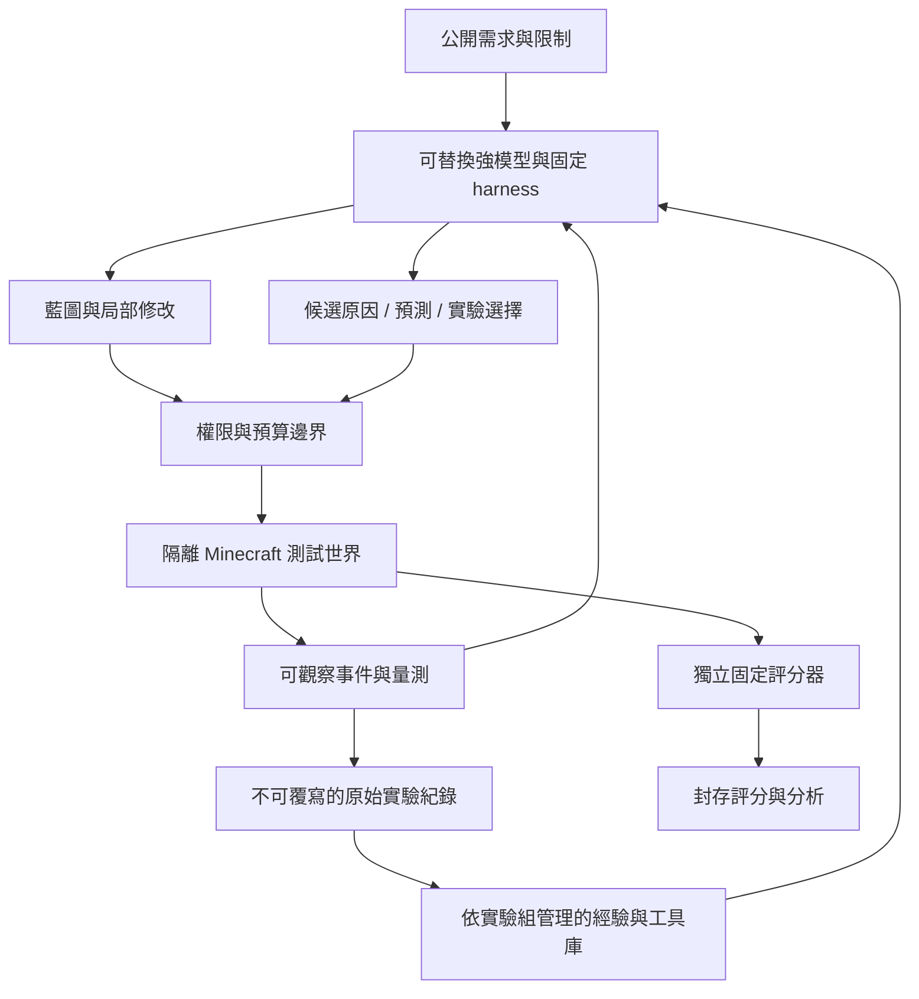

[計畫索引](README.md) · [範圍與 MVP](08-scope-and-mvp.md) · [方法](16-conditional-diagnostic-transfer.md)

# corrobora：跨農場診斷經驗轉移與持續自主工程

> 2026-10-01 研究計畫修訂。以下是待實作的設計與待驗證的假說，不是成果報告。

## 1. 研究問題

**在相同模型、工具、可用歷史與預算下，Agent 能否把過去農場的診斷實驗適当地轉移到新設計，以較低實驗成本達到指定工程品質，同時減少錯誤重用？**

長期目標是完整閉環：需求 → 初始設計 → 程式化建造 → 執行 → 測量 → 診斷 → 修改 → 回歸驗證 → 新農場。

Minecraft 是可執行工程環境；資訊科學問題是跨任務遷移、主動實驗選擇、錯誤歸因與持續學習。遊戲內結果不能直接推論成真實工廠的效益。

初期先研究有功能但未達需求／局部失效的完整農場，再加入從需求自主設計。只有維修成果時，不能對外稱已完成從零設計。

## 2. 三種不同層次的改善

| 改善對象 | 可驗證的證據 | 不能直接推出 |
| --- | --- | --- |
| 同一座農場 | 產出、可靠性、資源／空間限制達標 | Agent 本身已學習 |
| Agent 的跨農場表現 | 對未見設計，在配對基線下改善成本或成功率 | 修改模型權重、形成完整世界理論 |
| Agent 的學習流程 | 自行改進診斷／實驗策略，且後續新任務再次受益 | 無限制或自動加速的 RSI |

第一個研究集中在第二層。工具生成、信念修正、技能治理與 RSI 可以作後續機制，但不把每一項都放進第一篇。

## 3. 候選方法，不預設勝過強模型

暫稱 **Conditional Diagnostic Experience Transfer（CDET）**，名稱僅為本計畫的工作標籤，不代表已發表方法。

過去經驗保存「要區分的原因、適用條件、操作性預測、測試方法、觀察與修正範圍」。新農場中先對應模組角色，再辨識已成立、未知、不成立的前提；必要時選低成本測試。測試結果用來選擇修改，而不是立刻把一次失敗寫成永久禁令。

同一強模型使用原始紀錄或普通筆記可能已經做到相同的事。若 CDET 沒有額外效益，就簡化／刪除它，不以未來模型一定不會反省來論證必要性。

細節見 [16](16-conditional-diagnostic-transfer.md)。主動實驗、條件化技能與經驗記憶都有先例；貢獻必須是明確的方法差異或新的可重現實證，見 [13](13-related-work-and-completeness.md)。

## 4. 最小分層架構


```mermaid
flowchart TD
    Task[公開需求與限制] --> Agent[可替換強模型與固定 harness]
    Agent --> Design[藍圖與局部修改]
    Agent --> Experiment[候選原因 / 預測 / 實驗選擇]
    Design --> Boundary[權限與預算邊界]
    Experiment --> Boundary
    Boundary --> World[隔離 Minecraft 測試世界]
    World --> Observe[可觀察事件與量測]
    Observe --> Agent
    Observe --> Raw[不可覆寫的原始實驗紀錄]
    Raw --> Memory[依實驗組管理的經驗與工具庫]
    Memory --> Agent
    World --> Judge[獨立固定評分器]
    Judge --> Report[封存評分與分析]
```

Agent 看得到允許的觀察與開發回饋，不得讀取保留測試答案、故障標籤或修改評分器。設計世界、診斷副本、最終評測世界分開；測試副本的物品注入不能混入正式農場產量。

原始紀錄、持久經驗與當前工作狀態分開：

- **Raw evidence**：世界／版本／設定、操作、觀察、快照 hash 與成本，append-only。
- **Persistent experience**：可修訂的假說、診斷程序與適用條件；每次修訂指回證據。
- **Working state**：本次候選原因、未完成計畫、暫時推論；不自動成為長期事實。

## 5. 技術棧與既有設計的處理

Pilot 採 Python 控制／分析程式、型別化契約、Minecraft server adapter 與檔案式 immutable artifacts。中繼資料可先用 SQLite 或 JSONL；PostgreSQL、Qdrant 與 FastAPI 留在介面後方，只有實際併發、搜尋或外部服務需求出現才部署。這些是候選實作選擇，非已存在服務。

伺服器端若需要 mod，以固定遊戲／loader 版本實作；不在規劃階段承諾不存在的 API。先查所選版本支援的觀察能力，再固定測試契約。Shell 與生成腳本跑在隔離工作區，不提供主機、公開伺服器或評分器的任意寫入權。

建議後續模組（尚未建立）：

```text
src/corrobora/
  environment/   # 世界、snapshot、build/patch/run/observe
  experiments/   # 預測、干預、budget、原始紀錄
  agents/        # provider/harness adapter、各 baseline policy
  experience/    # 經驗契約、檢索、適用性與版本
  evaluation/    # 固定評分、split、checkpoint、cost accounting
  analysis/      # 配對比較、曲線、失敗分類
```

既有 corpus、來源政策、定位與 hash 可沿用；不先全量建知識圖譜，不先重造 generic harness，不把未取得的 `.litematic` 當作現成資產。原始資料與 legacy fixtures 保持不變。

## 6. 第一個研究可能交付什麼

| 貢獻類型 | 最少要交付 | 不足的替代品 |
| --- | --- | --- |
| 評測 | 完整農場、跨設計切分、長期歷史與錯誤重用情境；可重跑 runner 和基線 | 幾段成功影片或現有藍圖照抄 |
| 方法 | 適用性驗證與實驗選擇的具體決策，對照與消融顯示淨收益 | 新增 YAML 欄位或換名稱 |
| 實證 | 什麼經驗能遷移、何時有害、模型與成本條件如何改變結果 | 只報記憶命中率或最好的一次 |

結果不一定要支持複雜方法。若普通歷史足夠，或只在部分條件有益，也要保留完整資料並限制結論。

## 7. 非目標與延後項目

第一輪不做生存採礦／走路、不訓練領域模型、不任意改核心遊戲規則、不自動購買服務、不自行採用未授權 GitHub 程式、不以科展名次或全球第一作驗收。

跨遊戲版本、跨模型繼承、任意工具生態治理及 harness 自改，需在主問題成立且資源允許後另設實驗。從零設計不是永久排除，而是 [08](08-scope-and-mvp.md) 的獨立驗收階段。
