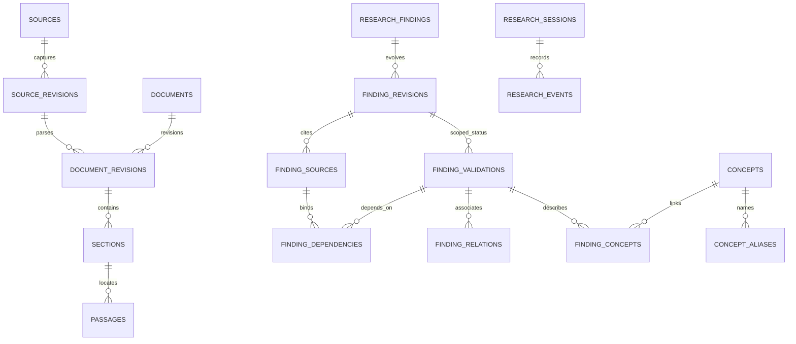

[索引](README.md) · [← 架構](00-overview-and-architecture.md) · [向量設計 →](02-qdrant-vector-design.md)

# PostgreSQL：研究資產的正式資料模型

> 邏輯 schema 提案，尚無 PostgreSQL migration。先說清楚資料責任、關聯與完整性，
> 再於實作里程碑落成 Alembic DDL；以下不是可直接執行的 SQL 清單。

## 1. 先看全貌

PostgreSQL 保存正式文字、結構、來源、有效狀態與歷程；原始 bytes 存 immutable blob store，
Qdrant 保存可重建的搜尋表示。Raw bytes 的權威是 blob，Findings 的權威是 PG，兩者不能互相替代。

多一層 `finding_revisions` 與 `finding_validations` 是刻意的：
**同一份結論的文字修訂，與「它在哪個版本仍可使用」，是兩件事。**
例如 Java 1.20.4 的結論仍成立，而對 1.21.11 尚待查證，不應只有一個全域 stale 布林值。
對外工具可回傳扁平的 Finding view，包含 title、statement、status、scope、sources；
不要求 Agent 自己拼接資料表。

## 2. 共通約定

- 內部 PK：`BIGINT GENERATED ALWAYS AS IDENTITY`；對外長期資產另給唯一 `public_id UUID`。
  匯出／匯入以 public ID 重新對應內部 FK，使更換模型或資料庫不破壞引用。
- 時間：UTC `TIMESTAMPTZ`。不可取得的 author、URL、revision time 用 NULL 加缺失原因，不能偽造。
- 原始 bytes、解析版正文、Finding revision、引用與歷程 append-only。
  可變欄位限 current pointer、作業狀態、有效性 projection；變更必有事件與 `row_version`。
- JSONB 僅存可變的條件、環境與事件 payload，需具 `schema_version` 並通過禁止額外欄位的模型。
  核心引用、status、版本、唯一鍵不能藏在任意 JSON 裡。
- 不用 `knowledge_objects(type, local_id)` 作通用實體註冊。舊版的 local_id 並沒有指向各實體的
  真正 FK；新表以少量 typed FK 或專用 join 表保護，不重造 Evidence ontology。
- 所有核心引用採 `ON DELETE RESTRICT`。immutable tables 的應用角色無 UPDATE／DELETE 權限；
  需要更正時追加修訂，不能靠「開發者記得不改」維持歷史。

## 3. Source、Raw 與文件層

| 表 | 主要欄位／關聯 | 身分與約束 |
| --- | --- | --- |
| `sources` | `id, public_id, source_key, source_type, display_name, author, original_url, license, license_url, attribution_rule, access_policy, export_policy, policy_version` | `source_key` 唯一；來源登記不自動覆寫後續人工政策 |
| `source_revisions` | `id, source_id, original_identifier, upstream_revision, raw_content_uri, raw_content_hash, normalized_content_hash, normalization_version, byte_size, encoding, captured_at, revision_at, metadata_snapshot` | 按來源＋原始識別＋上游 revision／內容身分去重；相同文字的不同路徑各保留來源 |
| `source_observations` | `id, source_id, original_identifier, source_revision_id, observed_at, outcome, import_run_id` | append-only；記錄重抓、消失、恢復及 A→B→A，不能只看最新 capture timestamp |
| `import_runs` | `id, source_id, importer_version, started_at, finished_at, status, counts, errors` | 一批成功不代表每個 parser 或 index job 完成，結果分別計數 |
| `documents` | `id, source_id, original_identifier, latest_revision_id` | `(source_id, original_identifier)` 唯一；文件的穩定身分 |
| `document_revisions` | `id, document_id, source_revision_id, logical_record_no, record_key, parser_version, title, author, language, parsed_text, version_hints, index_status` | revision 綁定實際 capture；CSV 記錄號／JSON pointer 是 locator，不假設跨修改穩定 |
| `sections` | `id, document_revision_id, parent_section_id, heading_path, order_index, start_offset, end_offset, quality_flags` | 層級／位置屬同一 document revision；重複標題用位置識別，不只以標題字串作 PK |
| `passages` | `id, section_id, order_index, start_offset, end_offset, raw_text, content_hash, language, version_scope_id, index_status` | 指定 revision 的可引用原文片段；`(section_id, order_index)` 唯一 |
| `document_links` | `id, document_revision_id, section_id, original_target, resolved_revision_id, link_kind, resolution_status` | 保留未解析外連；導航頁也保留 links，不必進 dense index |
| `document_assets` | `id, document_revision_id, original_target, source_revision_id, media_type, availability` | 圖片／附件原始檔案回鏈；下載失敗不刪文字 |
| `source_duplicates` | `source_revision_id, canonical_revision_id, comparison_kind, normalization_version` | 可重建去重 projection；canonical 不是唯一 provenance，也不是最可信來源 |

`source_revisions.metadata_snapshot` 至少保留當次已知 author、URL／identifier、license、language
與來源政策版本，避免日後修改 source metadata 讓舊引用改了署名。全文與欄位衝突原樣保留。
`revision_at` 是來源修訂時間，`captured_at` 是收錄時間，不能混用。

**雙 hash**：`raw_content_hash` 是原始 bytes SHA-256，用於保存與完整性；
`normalized_content_hash` 是 UTF-8 解碼、去 BOM、CRLF/CR→LF 後 SHA-256，用於文字去重。
不 trim、不改大小寫。兩者用途不同；舊 canonical hash 不能當作 bytes hash 直接搬入。
非文字資產只使用 raw hash。`normalization_version` 隨規則改版。

正文保存座標以 `parsed_text` 的 Unicode code-point、0-based 半開區間為主；另保留原始
byte offset／JSON pointer／CSV logical record 的 parser locator。HTML 移除導覽後的文字
不能假裝仍等於原始 HTML bytes；解析 transform 與 raw blob 必須都可回查。

來源同一性由 revision 原始識別決定，正文相同只用來省向量與解析成本。跨來源共享索引時，
仍保留每份 source link、權限與相對連結 base；不能因 canonical 位於 private 來源就遮蔽
public 副本，也不能透過 public 副本洩露 private metadata。MVP 可只共用 embedding cache。

## 4. 版本與術語

| 表 | 主要欄位／用途 |
| --- | --- |
| `game_versions` | `id, edition, version_string, release_order, version_type, parent_release_id`；edition 內 version string 與 release order 各唯一 |
| `version_scopes` | `id, edition, scope_kind, loader, server_implementation, environment_constraints, original_label`；`scope_kind=explicit/unknown/agnostic` |
| `version_scope_versions` | `version_scope_id, game_version_id` 複合 PK；明確、有限版本清單 |
| `concepts` | `id, public_id, slug, canonical_name, category, review_status`；category 可為 concept/mechanism/effect/constraint/entity/application |
| `concept_aliases` | `id, concept_id, alias, normalized_alias, language, alias_type, source_revision_id, review_status` |
| `concept_translations` | `id, concept_id, language, display_name, definition_passage_id, source_revision_id, review_status` |
| `concept_sources` | `concept_id, passage_id, source_revision_id, external_ref`；保留詞條與譯文来源 |
| `unresolved_references` | `id, source_revision_id, external_namespace, external_identifier, locator, reason`；待解析的詞典／機器關聯 |

Scope 建立後不原地擴大；新的適用版本建立新 scope／validation。
`1.20+` 先保存為來源 hint，不能自動包含將來版本。版本排序使用 release order，
但發布較晚的 snapshot 不代表繼承所有更早 release 的行為；相容性靠已驗證成員與環境。
`unknown` 與 `agnostic` 必須區分，前者不能當全版本有效。

Alias 唯一鍵為 `(concept_id, normalized_alias, language, source_revision_id)`，
查詢鍵有索引但不全域唯一，容許同詞異義。來源 `terms[]` 中的 Global/Local、
Serializer/Deserializer 是並列概念的例子，不能機械地把每個 terms[1:] 都當 synonyms。
合併不確定時保留多候選與來源上下文；沒有 concept ID 也不阻擋研究或保存 Finding。

## 5. Research Findings：正式內容、版本化有效性

| 表 | 主要欄位／關聯 | 責任 |
| --- | --- | --- |
| `research_findings` | `id, public_id, current_revision_id, created_at, created_by, row_version` | 穩定身分，便於跨模型使用；current 是導航捷徑，不是歷史引用目標 |
| `finding_revisions` | `id, finding_id, revision_no, parent_revision_id, title, statement, reasoning_summary, conditions, exceptions, typical_questions, unresolved_terms, admission_reason, created_session_id, created_at` | 不可覆寫的可重用研究結論；`(finding_id, revision_no)` 唯一 |
| `finding_validations` | `id, finding_revision_id, version_scope_id, status, last_verified_at, verified_by, verification_method, policy_version, dependency_generation, row_version` | 某 revision 在某版本／環境的目前有效性；每個 row 有狀態歷程 |
| `finding_concepts` | `validation_id, concept_id, relation_type` | 關聯綁有效 scope；concept category 表示 mechanism/effect/constraint/entity，relation_type 表示兩者關係 |
| `finding_reviews` | `id, validation_id, actor_id, decision, rationale, source_set_hash, checked_generation, created_at` | review 查的是哪份來源、哪個依賴 generation；append-only |

Finding 對外展開為：`finding_id + revision_id + validation_id + title + statement +
reasoning_summary + concepts + scope + status + sources + dependencies + timestamps`。
既有問題引用三個 ID 中的具體 revision／validation，不只引用 current pointer。
current_revision_id 僅是預設導航：查歷史版本仍須查所有符合目標 scope 的有效 revisions，
不能因最新 revision 用於新版，就把仍有效的舊版研究從檢索中排除。

`reasoning_summary` 是簡短的推導說明，不是證據，也不是隱藏思考鏈的揭露。
它只說明本 revision 由哪些來源與檢查組合得到，不能單獨支撐 `verified`；
驗證仍須回到 `finding_sources` 的具體引用、`finding_validations` 的 scope
與 `finding_reviews` 的檢查紀錄。

`status` 允許 `provisional / verified / disputed / needs_revalidation / stale / superseded`，
共六種，不另設 `forgotten` 或 `expired_by_time`。
狀態屬 `finding_validations`；不存在另一個可以不同步的 `research_findings.status`。
`verified` 表示通過指定驗證政策，不代表「模型覺得很有信心」；建立者不能自行賦值。
`stale` 須由證據、版本或依賴變動觸發，例如來源修訂、scope 成員失效或上游 validation 轉態，
絕不以 TTL 或經過時間自動判定。時間只影響排序與維護優先順序，不決定事實有效性。
候選被拒絕是 admission outcome，記在 session／review，無須硬塞入 Finding 的有效性 enum。

有效 scope 的成員不可重疊而產生兩個互相衝突的 active validation：相同 revision、相同環境
的兩筆 active scope 必須不交疊，寫入時以 finding row lock 檢查；局部失效時先拆分 scope，
保留原 validation 的 superseded 歷程，才改受影響部分。MVP 先每個 validation 一個精確版本，
大幅降低此處複雜度；`unknown` 可以 provisional，`agnostic` 需有明示的版本無關理由。

## 6. finding_sources：引用與依賴分工

`finding_sources` 保存「研究時看到什麼」：

| 欄位 | 定義 |
| --- | --- |
| `id, finding_revision_id` | 所屬結論的精確修訂 |
| `passage_id` | Documents 的精確段落；可沿文件樹還原 source revision |
| `source_revision_id` | 尚未切 passage 的 Raw 記錄或附件 |
| `code_symbol_id` | 精確 code version 的 symbol，不是裸 canonical symbol |
| `code_file_id` | 無 symbol 或涉及檔案／資源的 source locator |
| `experiment_run_id` | 具體量測 run，不只 experiment 名稱 |
| `upstream_validation_id` | 引用另一 Finding 的具體 revision／scope 有效性 |
| `role` | `supports / contradicts / context / derived_from`，四種角色維持不變 |
| `locator, quoted_text_hash, observed_at, note` | line range／record pointer 等，附當時觀測值 |

角色不新增通用的失敗記憶型別。失敗經驗經由具體 `experiment_run_id`、
來源引用或 observation 進入記錄，仍須指明是哪一次量測、哪一份來源、
哪一個觀測結果，不能以無定位的失敗標籤取代引用。

六種 target FK **恰有一個非 NULL**（PG `num_nonnulls(...) = 1`）。code 引用的 file、
version、mapping 與 hash 從 symbol／file FK 解出；line range 額外限定片段，不能與檔案矛盾。
若需要同時引用 passage 和其 source revision，revision 由 join 得到，不另填不一致的兩份值。

`finding_dependencies` 保存「哪個變動需要重新檢查」：

| 欄位 | 定義 |
| --- | --- |
| `id, validation_id, finding_revision_id, source_ref_id` | 對某個 scoped validation 的依賴；source_ref 指向 finding_sources |
| `dependency_kind` | `source_revision / passage / symbol_body / code_file / upstream_finding` |
| `observed_fingerprint, fingerprint_version` | hash／上游 validation generation，記錄依賴基準 |
| `watch_mode` | `pinned / follow_source / compare_target_version`；歷史版本與 current-source 分開 |
| `impact, reason` | `required / supplementary` 與依賴理由；前者阻止直接覆用，後者觸發 review 提示 |

以 `(validation_id, finding_revision_id)`、`(source_ref_id, finding_revision_id)` 複合 FK
保證 dependency 不會綁到別份結論的 source。dependency_kind 必須與 target FK 型別一致。
常見引用不全是必要依賴；反過來，推論依賴的 caller、config、tag 檔即使沒在最終答案引用，
仍應記入來源／依賴集合。保守 fallback 是檔案級、必要時 repo snapshot 級 dependency。

索引：validation→dependencies、source_ref→dependencies，以及 finding_sources 的每一種
target FK 均建反向索引。依賴另一 Finding 時，指向 `upstream_validation_id`，
採有向無環依賴；循環關聯可存在 graph，但循環「互相證明」不可用於驗證。

## 7. 關聯圖的最小模型

- `finding_relations(id, from_validation_id, to_validation_id, relation_type, conditions,
  created_session_id, review_status, rationale, created_at)`：Finding 對 Finding，雙向索引。
  可用 `RELATED_TO / DERIVED_FROM / SUPPORTS / CONTRADICTS / EXTENDS / SUPERSEDES /
  REQUIRES`；relation 不是 dependency 的替代品。
- `finding_concepts` 以 `(validation_id, concept_id, relation_type)` 為複合 PK，relation_type
  為 `RELATED_TO / REQUIRES / PRODUCES / APPLIES_TO / USES_MECHANISM`；
  由 validation 取得 revision 與 scope，不建另一套重複的 Finding→Concept 邊。
- `concept_symbol_links(concept_id, code_symbol_id, relation_type, validation_id)` 表达少量
  `IMPLEMENTED_BY` bridge，必須能回到支持此解釋的 Finding validation。
- `machine_concepts(machine_revision_id, concept_id, relation_type, validation_id)` 表达
  `USES_MECHANISM / APPLIES_TO`；原始 tags 另外保存，不自動變成 semantic relation。
- Source／Passage／Experiment 節點直接沿 finding_sources 展開；不用再註冊成通用物件。

圖遍歷按每筆 validation 的版本、狀態與權限過濾，不能只檢查 seed。
`SUPERSEDES` 表达在相容 scope 下新→舊，不能誤解為所有版本都替代。
新增 target 型別需專用 FK migration，這是相較任意多型 registry 的可接受取捨。

## 8. Code 與 Blueprint 資產

| 表 | 必要資訊 |
| --- | --- |
| `code_repositories` | `id, source_id, repository_key, origin, access_policy` |
| `code_versions` | `id, repository_id, game_version_id, commit_id, snapshot_hash, snapshot_uri, mapping_name, mapping_version, decompiler_version, toolchain_manifest` |
| `code_files` | `id, code_version_id, relative_path, raw_hash, language`；version＋path 唯一 |
| `code_canonical_symbols` | `id, repository_id, stable_key`；跨版本邏輯 identity，配對不確定時不強行共用 |
| `code_symbols` | `id, code_file_id, canonical_symbol_id, kind, qualified_name, signature, start_line, end_line, body_hash, extractor_version` |
| `code_edges` | `id, code_version_id, from_symbol_id, to_symbol_id, edge_type, resolution, extractor_version, call_site` |
| `machines` | `id, public_id, source_id, external_id, sub_id, current_revision_id, source_removed_at, review_status` |
| `machine_revisions` | `id, machine_id, source_revision_id, name, author, description, filename, preview, original_order, declared_version_hints` |
| `machine_tags` | `machine_revision_id, tag` 複合 PK；保留文字與來源，不推定已驗證 |
| `blueprint_assets` | `id, machine_revision_id, source_revision_id, format, availability`；有檔案才建立已取得資產 |
| `experiments / experiment_runs` | protocol、環境、game version、seed、工具版本、raw logs、量測值／單位／sample count |

symbol 唯一鍵包含 code file、qualified name、kind、signature，overload 不可合併。
所有 code edges 的兩端必須屬同 code_version（複合 FK／constraint trigger），解析不確定的
reference 另記 unresolved locator，不偽造 resolved call edge。line 為 1-based inclusive。
樹 hash／commit ID 以實際取得值登記，不從資料夾名稱猜 Minecraft 版本。

## 9. 研究軌跡與執行存檔（Research Trace / Execution Archive）

| 表 | 主要欄位 |
| --- | --- |
| `research_sessions` | `id, public_id, original_query, scope, corpus_snapshot, memory_snapshot, agent_model, prompt_version, tool_contract_version, budget, outcome, final_answer_ref, started_at, finished_at` |
| `research_events` | `id, session_id, sequence_no, event_type, schema_version, payload, occurred_at, parent_event_id`；`(session_id, sequence_no)` 唯一 |
| `jobs` | `id, job_type, idempotency_key, payload, status, attempts, available_at, lease_owner, lease_until, lease_generation, last_error` |
| `index_outbox` | `id, aggregate_key, aggregate_generation, operation, created_at, processed_at`；同 PG transaction 建立 |
| `index_builds` | `id, target, encoder_contract, representation_version, corpus_snapshot, collection_name, state, high_watermark` |
| `invalidation_events` | `id, change_key, target_ref, old_fingerprint, new_fingerprint, detected_at, affected_count, status` |

events 包含 findings retrieved／read／used／rejected、passages retrieved／read、
documents／code files opened、tools called、candidate／consolidation／revalidation outcome、
coverage assessment、tokens、API cost、latency。其中 `retrieved` 僅表示被檢索回傳，
`read` 表示已讀取內容，`used` 表示進入本次推導，`associated` 表示僅具關聯、
`causally-helpful` 才表示對結論有因果幫助；五者不可混用，不能把檢索到等同於已採用。
payload 裡核心 ID 使用有型別的 reference，入庫檢查存在性；事件保存的是當時事實，不跟 current pointer 改寫。
general logs 不寫私人正文／token；session 原始 query 與回答屬受權限保護的研究資料。
不要求模型揭露隱藏思考鏈，僅記錄外顯行動、簡短判斷理由與結果。
`research_events` 是執行軌跡存檔，預設不進入 Finding 通用語意檢索；
Trace 回答「當時做了什麼」，Finding 回答「目前可重用的結論」，兩者語意檢索分開。

## 10. 唯一鍵與交易邊界的落地提案

為避免討論稿只有概念、實作時又各自發明 identity，建議先採：

- `source_revisions`：`(source_id, original_identifier, upstream_revision, raw_content_hash)`
  用 `UNIQUE NULLS NOT DISTINCT`（PG 15+）處理缺 upstream revision；
  capture time 不在去重鍵，重抓另寫 observation，不吞掉不同原始路徑。
- `document_revisions`：`(document_id, source_revision_id, record_key, parser_version)`，
  record_key 對整檔固定為 `file`，CSV／JSON 則為明示的 logical record locator；
  nullable logical_record_no 不當唯一鍵的唯一保護。
- `finding_validations`：`(finding_revision_id, version_scope_id)` 唯一，同 row 的狀態變化
  寫 reviews/events；scope 重疊的規則另外在鎖住 finding 後檢查。
- `finding_sources`：每個 typed target 以 revision＋target＋role＋locator 建唯一鍵，
  NULL-safe 實作可用各 target 的 partial unique index；所有 target 有真正 FK。
- job claim 用 `FOR UPDATE SKIP LOCKED`、lease_generation 與期限；完成／續租必須帶
  matching owner＋generation，逾期 worker 的結果不得蓋過新 worker。
- 來源發布／失效、Finding write、review／consolidation 分別使用小型 transaction。
  LLM semantic comparison 在外部執行，提交前再驗來源 generation；索引走 outbox。

## 11. 實作必須驗證的資料不變量

1. immutable snapshot 可離線還原；原路徑刪改後舊引用仍可讀。
2. document latest、finding current 等指標的 revision 必須屬於同一父實體。
3. FK target 唯一、範圍一致；不得懸空依賴或跨 mapping 混接。
4. `verified` 必須有 review、精確 scope、至少一個有效支持鏈；不存在支持鏈不能只靠 enum 升格。
5. 失效事件先寫 PG 並增加 generation；在 Qdrant／worker 落後時，PG 仍禁止過期覆用。
6. 同步／重播不覆蓋 review；併發 consolidation 以版本鎖檢查，避免雙重 merge。
7. source 權限變更適用於所有衍生 Findings、graph expansion 與 index hydration。
8. idempotency key 不等於語意等價鍵；同 wording 在不同 constraints 下可有不同 Finding。

MVP 建表順序與可以延後的 extension 見[範圍](08-scope-and-mvp.md)；
consolidation、狀態轉移與失效传播見[記憶生命週期](11-research-memory-lifecycle.md)。
