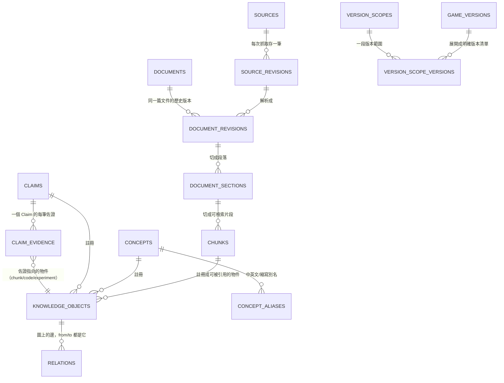

[索引](README.md) ｜ [← 總覽與整體架構](00-overview-and-architecture.md) ｜ [Qdrant 向量與 Payload 設計 →](02-qdrant-vector-design.md)

---

## 3. PostgreSQL Schema

原則：

- 所有 primary key 用 `BIGINT GENERATED ALWAYS AS IDENTITY`（除了需要語意穩定 ID 的 `concepts.slug` 等）。
- Raw source **immutable**：`source_revisions` 只增不改；`document_revisions`/`chunks` 都指向特定 revision（見 3.2 節，這是 v2 修正——原本 `documents` 直接指單一 `current_revision_id` 無法回答「這個 chunk 屬於哪個 revision」）。
- 每個可檢索實體都有 `version_scope_id`（FK 到 `version_scopes`）與 `status`（`pending|approved|rejected|deprecated|disputed`）。版本比較一律走 `game_versions.release_order` 整數排序，**不對版本字串做字典序比較**（`"1.9"` < `"1.10"` 字典序是錯的）。
- 所有跨型別的多型參照（`relations`、`claim_evidence` 等）統一透過 `knowledge_objects` 註冊表解出真正 FK，而不是裸的 `(type, id)` pair，見 3.9 節。
- 每個表都有 `created_at`, `updated_at`，重要表加 `created_by`。

### 3.0 全貌：這些表怎麼串在一起

底下 10 個子節會逐一定義表，資訊量很密。在進去細節前，先看一張簡化的關係圖，抓住「一份文件怎麼變成一個能被信任的答案來源」這條主線——文字或程式碼陌生的讀者可以只看這張圖跟圖後面的白話說明，跳過後面 3.1-3.10 的 SQL 也不影響理解全局：



**白話說**：整條主線讀起來是「一份原始資料（`sources`）→ 每次抓到的內容存一筆不可竄改的快照（`source_revisions`）→ 解析成一篇文件的某個版本（`document_revisions`）→ 切成段落（`document_sections`）→ 切成可以被搜尋、被引用的最小片段（`chunks`）」。這條線走完之後，`chunks` 才會被「登記」進 `knowledge_objects`——這一步很關鍵，`concepts`、`claims` 也都要登記進 `knowledge_objects`，之後不管是「這個 Claim 的佐證是哪個 chunk」（`claim_evidence`）還是「這兩個概念之間有什麼關係」（`relations`），全部都指向 `knowledge_objects` 這個統一的門牌號碼，而不是各自直接互相指來指去。`game_versions`/`version_scopes`/`version_scope_versions` 是另一條獨立支線，負責回答「這筆資料適用哪些遊戲版本」，被幾乎所有上面的表引用。3.1-3.10 節會把每張表的實際欄位、為什麼這樣設計、跟哪裡出過什麼問題講清楚。

### 3.1 來源與版本控制

**Raw content 不放 PostgreSQL**：文字資料量小時 BYTEA 沒問題，但 Phase 2+ 會匯入原始碼/Litematic/大型資料集，會把 PG 撐肥、備份變慢。改為 PG 只存 hash/metadata/URI，bytes 進物件儲存（本地開發用 filesystem，正式環境用 MinIO/S3 相容介面）。

```sql
CREATE TABLE sources (
  id BIGINT GENERATED ALWAYS AS IDENTITY PRIMARY KEY,
  type TEXT NOT NULL,              -- 'wiki'|'gtmc_doc'|'discord'|'source_code'|'csv_legacy'
  name TEXT NOT NULL,
  url TEXT,
  license TEXT,
  trust_level SMALLINT NOT NULL DEFAULT 2,  -- 1=低 5=高，人工設定
  created_at TIMESTAMPTZ NOT NULL DEFAULT now()
);

CREATE TABLE source_revisions (
  id BIGINT GENERATED ALWAYS AS IDENTITY PRIMARY KEY,
  source_id BIGINT NOT NULL REFERENCES sources(id),
  content_hash CHAR(64) NOT NULL,       -- SHA-256，同 hash 不重複匯入
  raw_content_uri TEXT NOT NULL,        -- 物件儲存位址（如 file://... 或 s3://...），bytes immutable
  byte_size BIGINT NOT NULL,
  fetched_at TIMESTAMPTZ NOT NULL DEFAULT now(),
  UNIQUE (source_id, content_hash)
);
```

**遊戲版本本體化**：不能對 `"1.9"`/`"1.10"`/`"1.21-pre2"`/`"24w14a"` 這類版本字串做字典序或字串 range 比較。建立顯式版本序表，`release_order` 是整個系統唯一的版本排序依據：

```sql
CREATE TABLE game_versions (
  id BIGINT GENERATED ALWAYS AS IDENTITY PRIMARY KEY,
  edition TEXT NOT NULL,             -- 'java'|'bedrock'
  version_string TEXT NOT NULL,      -- '1.20.1'、'24w14a'、'1.21-pre2'
  release_order INT NOT NULL,        -- 按實際發布時間排序的整數，同一 edition 內嚴格遞增
  version_type TEXT NOT NULL,        -- 'release'|'snapshot'|'pre_release'|'rc'
  parent_release_id BIGINT REFERENCES game_versions(id),  -- snapshot/pre-release 對應的正式版
  UNIQUE (edition, version_string)
);
CREATE INDEX idx_game_versions_order ON game_versions(edition, release_order);

CREATE TABLE version_scopes (
  id BIGINT GENERATED ALWAYS AS IDENTITY PRIMARY KEY,
  edition TEXT NOT NULL,             -- 'java'|'bedrock'|'agnostic'
  min_version_id BIGINT REFERENCES game_versions(id),
  max_version_id BIGINT REFERENCES game_versions(id),
  loader TEXT,                       -- 'vanilla'|'fabric'|'paper'|NULL
  notes TEXT
);

-- 每個 version_scope 建立時，由應用層依 release_order 展開成明確的版本清單，
-- 這份展開結果同時是 PG join 的依據，也是要寫進 Qdrant payload 的 version_ids 來源（見4.2/4.3節）
CREATE TABLE version_scope_versions (
  version_scope_id BIGINT NOT NULL REFERENCES version_scopes(id),
  game_version_id BIGINT NOT NULL REFERENCES game_versions(id),
  PRIMARY KEY (version_scope_id, game_version_id)
);
```

`version_scope_versions` 的展開規則（應用層函式，`version_scopes` insert/update 後觸發）：`SELECT id FROM game_versions WHERE edition=:edition AND release_order BETWEEN (SELECT release_order FROM game_versions WHERE id=:min_version_id) AND (SELECT release_order FROM game_versions WHERE id=:max_version_id)`，一次寫入所有 `(version_scope_id, game_version_id)` pair。之後任何「版本相容判斷」一律查這張展開表，不在查詢當下重算 range。

> **白話說**：假設 `game_versions` 裡按發布順序編了號：`1.19=100`、`1.19.1=101`、`1.20=110`、`1.20.1=111`、`1.21=120`。如果一個 Claim 說「這個機制在 1.19 到 1.20.1 都成立」，我們不會存 `version_min="1.19", version_max="1.20.1"` 這種字串再去比大小（字串比較會出現 `"1.9" > "1.20"` 這種荒謬結果，因為 `'9'` 這個字元比 `'2'` 大）。而是直接展開寫死：「這個範圍包含 100, 101, 110, 111 這四個具體版本」存進 `version_scope_versions`。之後查「這筆資料適不適用 1.20.1」，就只是問「111 在不在這張已經展開好的清單裡」，是一次精確的整數/清單比對，不會有任何比較邏輯出錯的空間。


### 3.2 文件

**v2 修正（provenance 漏洞）**：原設計 `documents.current_revision_id` 指向單一 revision，而 `document_sections`/`chunks` 直接掛在 `documents.id` 下——一旦來源更新出新 revision，舊 chunk 到底屬於哪個 revision 無法回答，Claim 引用的證據也就失去精確版本錨點。修正方式是插入 `document_revisions` 一層，`sections`/`chunks` 一律掛在 revision 底下，不掛在 `documents` 底下：

```text
sources -> source_revisions -> document_revisions -> document_sections -> chunks
```

```sql
CREATE TABLE documents (
  id BIGINT GENERATED ALWAYS AS IDENTITY PRIMARY KEY,
  source_id BIGINT NOT NULL REFERENCES sources(id),
  title TEXT NOT NULL,
  language TEXT NOT NULL,
  latest_approved_revision_id BIGINT,  -- 純方便查詢用的指標，只在審核通過後更新，不是 provenance 依據
  created_at TIMESTAMPTZ NOT NULL DEFAULT now()
);

CREATE TABLE document_revisions (
  id BIGINT GENERATED ALWAYS AS IDENTITY PRIMARY KEY,
  document_id BIGINT NOT NULL REFERENCES documents(id),
  source_revision_id BIGINT NOT NULL REFERENCES source_revisions(id),  -- 對應哪次原始資料抓取
  version_scope_id BIGINT REFERENCES version_scopes(id),
  parser_version TEXT NOT NULL,       -- 切段規則版本號，parser 邏輯改變時可重新匯入而不覆蓋舊 revision
  status TEXT NOT NULL DEFAULT 'pending',
  created_at TIMESTAMPTZ NOT NULL DEFAULT now()
);
ALTER TABLE documents
  ADD CONSTRAINT fk_documents_latest_revision
  FOREIGN KEY (latest_approved_revision_id) REFERENCES document_revisions(id);

CREATE TABLE document_sections (
  id BIGINT GENERATED ALWAYS AS IDENTITY PRIMARY KEY,
  document_revision_id BIGINT NOT NULL REFERENCES document_revisions(id),
  heading_path TEXT[] NOT NULL,      -- ['H1','H2',...]
  order_index INT NOT NULL
);

CREATE TABLE chunks (
  id BIGINT GENERATED ALWAYS AS IDENTITY PRIMARY KEY,
  section_id BIGINT NOT NULL REFERENCES document_sections(id),
  content TEXT NOT NULL,
  token_count INT NOT NULL,
  status TEXT NOT NULL DEFAULT 'pending',
  qdrant_point_id UUID              -- 反查用，避免 PG/Qdrant 不同步
);
CREATE INDEX idx_chunks_status ON chunks(status);
```

這樣一筆 `claim_evidence` 引用的 `chunk_id` 可以沿 `chunk -> section -> document_revision -> source_revision` 精確回答「這個證據來自哪次抓取、哪個 parser 版本」，來源更新後舊 Claim 是否仍成立，只要比對新舊 `document_revision` 的 `content_hash`（透過 `source_revision`）即可判斷，而不用去猜哪個 chunk 是新是舊。

> **白話說**：想像 GTMC 文件作者把某篇文章改版了（v2 修正了一個錯誤的漏斗時序說明）。有一個 Claim 當初是引用 v1 版本裡的某段話建立的。如果沒有 `document_revisions` 這一層，系統只知道「這個 chunk 屬於 xxx.md 這篇文件」，等文件被改版覆蓋後，那個 chunk 的內容就悄悄變了，但 Claim 還在引用同一個 chunk id——審核者完全看不出來這個 Claim 賴以成立的原文其實已經不是原來那段話了。有了 `document_revisions`，v1 的 chunk 永遠是 v1 版本底下的東西，v2 改版會產生一批新的 chunk，v1 舊的原封不動留著，Claim 引用的證據永遠指向當初真正看到的那段文字，之後要不要因為原文改版而重新審核這個 Claim，是一個可以被明確提出來討論的問題，而不是一個被悄悄改掉、沒人發現的資料錯誤。

### 3.3 術語 / 概念層

```sql
CREATE TABLE concepts (
  id BIGINT GENERATED ALWAYS AS IDENTITY PRIMARY KEY,
  slug TEXT NOT NULL UNIQUE,         -- 'block_update_detector'
  canonical_name TEXT NOT NULL,
  category TEXT NOT NULL,            -- 'mechanism'|'entity'|'concept'|...
  status TEXT NOT NULL DEFAULT 'pending',
  external_ref TEXT,                 -- 遷移來源的原始 ID（如 dictionary entry 的 Discord thread id）
  external_ref_pending JSONB         -- 尚無法解析的外部引用，見 5.1.5 節 referencedBy 落差
);

CREATE TABLE concept_aliases (
  id BIGINT GENERATED ALWAYS AS IDENTITY PRIMARY KEY,
  concept_id BIGINT NOT NULL REFERENCES concepts(id),
  alias TEXT NOT NULL,
  language TEXT NOT NULL,
  alias_type TEXT NOT NULL           -- 'abbr'|'translation'|'slang'
);
CREATE INDEX idx_alias_lookup ON concept_aliases(lower(alias));
```

### 3.4 領域本體：Mechanism / Effect / Constraint / Application（v2 修正：全部 Concept 化）

**問題**：原設計把 `effects`/`constraints`/`applications` 當獨立自由文字表，但實際查詢（「有什麼機制可以讓生物自己聚集」）需要「mob concentration / entity concentration / 聚怪 / 自動聚集 / 將生物吸引到同一位置」這些說法指向同一個節點——這正是 `concepts` + `concept_aliases` 已經解決的問題。若不統一，Knowledge Graph 很快會出現大量語意重複但字面不同的節點，`relations` 也無從去重。

**修正**：`mechanism`/`effect`/`constraint`/`application` 全部是 `concepts.category` 的其中一種取值，共用同一套 `concept_aliases`/`concept_translations`/`external_ref`；各自的專屬欄位（如 constraint 的 `constraint_type`）拆到「detail 表」，以 `concept_id` 當 PK 兼 FK（類似 table-per-subtype 繼承）：

```sql
-- concepts.category 現在允許：'mechanism'|'entity'|'effect'|'constraint'|'application'|'concept'

CREATE TABLE mechanism_details (
  concept_id BIGINT PRIMARY KEY REFERENCES concepts(id),
  description TEXT NOT NULL,
  version_scope_id BIGINT REFERENCES version_scopes(id)
);

CREATE TABLE effect_details (
  concept_id BIGINT PRIMARY KEY REFERENCES concepts(id),
  description TEXT NOT NULL,
  effect_domain TEXT             -- 'entity_behavior'|'redstone_signal'|'inventory_state'|...，選填分類
);

CREATE TABLE constraint_details (
  concept_id BIGINT PRIMARY KEY REFERENCES concepts(id),
  description TEXT NOT NULL,
  constraint_type TEXT NOT NULL  -- 'version'|'environment'|'resource'|'physical'
);

CREATE TABLE application_details (
  concept_id BIGINT PRIMARY KEY REFERENCES concepts(id),
  description TEXT NOT NULL
);
```

`status`/`review_status`、alias、translation 全部走 `concepts` 本體，不在 detail 表重複。查「讓生物自動聚集有什麼機制」時，先在 `concepts(category='effect')` 用 alias/embedding 找到「Mob Concentration」這個 effect concept，再透過 `relations(mechanism, PRODUCES, effect)` 反查 mechanism（第7節查詢範例已更新）。`mechanism` ←→ `effect`/`constraint`/`application` 之間，以及 mechanism/effect/constraint/application 彼此之間，一律透過 `relations` 表連結（見 3.9），不建立各自的 join table，避免關係型別爆炸。

> **白話說**：如果 `effects` 是一張自由文字表，「聚怪」「自動聚集」「mob concentration」「將生物吸引到同一位置」這四句話字面上完全不同，系統會把它們存成四筆互不相干的資料，之後查「有什麼機制能聚怪」只找得到剛好用「聚怪」兩個字寫的那份文件，漏掉其他三份。把 effect 併進 `concepts` 之後，這四句話變成同一個 concept 的四個別名（`concept_aliases`），不管使用者用哪一種說法提問，都能命中同一個節點，再從那個節點往外查有哪些 mechanism 會 `PRODUCES` 它。

### 3.5 Claim 系統

```sql
CREATE TABLE claims (
  id BIGINT GENERATED ALWAYS AS IDENTITY PRIMARY KEY,
  statement TEXT NOT NULL,               -- 單一可驗證敘述，atomic
  edition TEXT,
  version_from_id BIGINT REFERENCES game_versions(id),  -- v2 修正：不再用 TEXT，見3.1節 game_versions
  version_to_id BIGINT REFERENCES game_versions(id),
  confidence TEXT NOT NULL,              -- 'documented'|'expert_reviewed'|'measured'|'inferred'|'unverified'
  review_status TEXT NOT NULL DEFAULT 'pending',  -- pending|approved|rejected|deprecated|disputed
  created_from_source_id BIGINT REFERENCES source_revisions(id),
  created_at TIMESTAMPTZ NOT NULL DEFAULT now(),
  updated_at TIMESTAMPTZ NOT NULL DEFAULT now()
);

CREATE TABLE claim_conditions (
  id BIGINT GENERATED ALWAYS AS IDENTITY PRIMARY KEY,
  claim_id BIGINT NOT NULL REFERENCES claims(id),
  condition_type TEXT NOT NULL,
  content TEXT NOT NULL
);

CREATE TABLE claim_exceptions (
  id BIGINT GENERATED ALWAYS AS IDENTITY PRIMARY KEY,
  claim_id BIGINT NOT NULL REFERENCES claims(id),
  content TEXT NOT NULL
);

CREATE TABLE claim_evidence (
  id BIGINT GENERATED ALWAYS AS IDENTITY PRIMARY KEY,
  claim_id BIGINT NOT NULL REFERENCES claims(id),
  evidence_object_id BIGINT NOT NULL REFERENCES knowledge_objects(id),  -- v2 修正：見3.9節 knowledge_objects，
                                       -- 取代原本的 (evidence_type, evidence_id) 裸多型欄位
  stance TEXT NOT NULL,               -- 'supports'|'contradicts'
  note TEXT
);

CREATE TABLE human_reviews (
  id BIGINT GENERATED ALWAYS AS IDENTITY PRIMARY KEY,
  target_type TEXT NOT NULL,          -- 'claim'|'concept'|'relation'|...
  target_id BIGINT NOT NULL,
  reviewer_id TEXT NOT NULL,
  decision TEXT NOT NULL,             -- 'approve'|'reject'|'request_changes'
  comment TEXT,
  created_at TIMESTAMPTZ NOT NULL DEFAULT now()
);
```

### 3.6 實體 / 農場 / 元件（Minecraft 領域實例層）

```sql
CREATE TABLE entities (       -- 通用「領域實體」，如 Zombified Piglin
  id BIGINT GENERATED ALWAYS AS IDENTITY PRIMARY KEY,
  concept_id BIGINT NOT NULL REFERENCES concepts(id),
  entity_kind TEXT NOT NULL   -- 'mob'|'block'|'item'
);

CREATE TABLE farms (
  id BIGINT GENERATED ALWAYS AS IDENTITY PRIMARY KEY,
  name TEXT NOT NULL,
  author TEXT,
  external_ref TEXT,                 -- database.json 的 sub_id，維持與既有分享連結相容
  version_scope_id BIGINT REFERENCES version_scopes(id),
  status TEXT NOT NULL DEFAULT 'pending'
  -- 取代 database.json，遷移細節見第 5.1.4 節
);

CREATE TABLE farm_components (
  id BIGINT GENERATED ALWAYS AS IDENTITY PRIMARY KEY,
  farm_id BIGINT NOT NULL REFERENCES farms(id),
  component_type TEXT NOT NULL   -- 'spawn_platform'|'transport'|'kill_chamber'|...
);
```

### 3.7 實驗

```sql
CREATE TABLE experiments (
  id BIGINT GENERATED ALWAYS AS IDENTITY PRIMARY KEY,
  title TEXT NOT NULL,
  version_scope_id BIGINT REFERENCES version_scopes(id),
  setup JSONB NOT NULL,
  procedure TEXT NOT NULL,
  status TEXT NOT NULL DEFAULT 'pending'
);

CREATE TABLE experiment_runs (
  id BIGINT GENERATED ALWAYS AS IDENTITY PRIMARY KEY,
  experiment_id BIGINT NOT NULL REFERENCES experiments(id),
  run_at TIMESTAMPTZ NOT NULL DEFAULT now(),
  environment JSONB NOT NULL       -- seed, gamerules, sim distance...
);

CREATE TABLE experiment_results (
  id BIGINT GENERATED ALWAYS AS IDENTITY PRIMARY KEY,
  run_id BIGINT NOT NULL REFERENCES experiment_runs(id),
  metric TEXT NOT NULL,
  value DOUBLE PRECISION NOT NULL,
  unit TEXT,
  sample_count INT
);
```

### 3.8 程式碼符號（第 12-13 節詳述 pipeline）

**補丁原則：`code_symbols` 只存機器事實，定義放外部**：`code_symbols` 只記錄抽取器能決定的事實（版本、mapping、檔案位置、hash），人類可讀的定義、解釋、領域對應一律進 `code_annotations`。`IMPLEMENTED_BY → Domain Concept` 這條邊本身也是外部 metadata，走 `relations`，不寫進 `code_symbols`。

> **白話說**：`code_symbols` 是戶籍謄本，只寫「這個版本、這個 mapping、這個檔案第幾行長什麼樣」。你覺得它是什麼意思、對應哪個遊戲概念，寫到 `code_annotations` 和 `relations`，版本一變不用把解釋複製一份。

```sql
CREATE TABLE code_versions (
  id BIGINT GENERATED ALWAYS AS IDENTITY PRIMARY KEY,
  edition TEXT NOT NULL,
  game_version_id BIGINT NOT NULL REFERENCES game_versions(id),  -- v2 修正：不再用 TEXT
  mapping_name TEXT NOT NULL,        -- 'mojmap'|'yarn'|'searge'
  created_at TIMESTAMPTZ NOT NULL DEFAULT now(),
  updated_at TIMESTAMPTZ NOT NULL DEFAULT now()
);

-- 穩定身份表：之前 canonical_symbol_id 只是裸 BIGINT，沒有 PK
-- 現在扶正，跨版本同一個邏輯符號共用同一個 canonical id
CREATE TABLE code_canonical_symbols (
  id BIGINT GENERATED ALWAYS AS IDENTITY PRIMARY KEY,
  stable_key TEXT NOT NULL UNIQUE,   -- 例如 'net.minecraft.HopperBlockEntity#transferCooldown'
  first_seen_at TIMESTAMPTZ NOT NULL DEFAULT now(),
  notes TEXT
);

CREATE TABLE code_symbols (
  id BIGINT GENERATED ALWAYS AS IDENTITY PRIMARY KEY,
  code_version_id BIGINT NOT NULL REFERENCES code_versions(id),
  canonical_symbol_id BIGINT NOT NULL REFERENCES code_canonical_symbols(id),
  fqcn TEXT NOT NULL,                -- fully qualified name
  symbol_kind TEXT NOT NULL,         -- 'class'|'method'|'field'
  signature TEXT,
  ast_hash CHAR(64),
  body_hash CHAR(64),
  file_path TEXT NOT NULL,
  start_line INT,
  end_line INT,
  knowledge_object_id BIGINT UNIQUE, -- 由 trigger 回填，見 3.9 節
  created_at TIMESTAMPTZ NOT NULL DEFAULT now(),
  updated_at TIMESTAMPTZ NOT NULL DEFAULT now()
);
CREATE INDEX idx_symbol_fqcn ON code_symbols(fqcn);
CREATE INDEX idx_symbol_canonical ON code_symbols(canonical_symbol_id);

-- 外部定義表：人話、領域對應、審核，全在這裡，不進 code_symbols
CREATE TABLE code_annotations (
  id BIGINT GENERATED ALWAYS AS IDENTITY PRIMARY KEY,
  canonical_symbol_id BIGINT NOT NULL REFERENCES code_canonical_symbols(id),
  -- NULL = 通用定義，適用所有版本；非 NULL = 只適用某個版本範圍
  version_scope_id BIGINT REFERENCES version_scopes(id),
  display_name TEXT NOT NULL,
  description TEXT NOT NULL,
  interpretation TEXT,               -- 這段 code 被用來證明什麼 Claim
  confidence TEXT NOT NULL DEFAULT 'unverified'
    CHECK (confidence IN ('documented','expert_reviewed','measured','inferred','unverified')),
  review_status TEXT NOT NULL DEFAULT 'pending'
    CHECK (review_status IN ('pending','approved','rejected','deprecated','disputed')),
  created_by TEXT NOT NULL,          -- reviewer_id / 'ai:claim_extract@v1' / 'system:indexer'
  created_at TIMESTAMPTZ NOT NULL DEFAULT now(),
  updated_at TIMESTAMPTZ NOT NULL DEFAULT now()
);
CREATE INDEX idx_anno_canonical ON code_annotations(canonical_symbol_id);
CREATE INDEX idx_anno_review ON code_annotations(review_status);
CREATE UNIQUE INDEX uq_anno_canonical_scope
  ON code_annotations(canonical_symbol_id, version_scope_id);
-- PG 視 NULL 為相異，上面擋不住兩個通用定義，需另加 partial index
CREATE UNIQUE INDEX uq_anno_canonical_generic
  ON code_annotations(canonical_symbol_id)
  WHERE version_scope_id IS NULL;

CREATE TABLE code_symbol_diffs (
  id BIGINT GENERATED ALWAYS AS IDENTITY PRIMARY KEY,
  canonical_symbol_id BIGINT NOT NULL REFERENCES code_canonical_symbols(id),
  from_code_version_id BIGINT NOT NULL REFERENCES code_versions(id),
  to_code_version_id BIGINT NOT NULL REFERENCES code_versions(id),
  diff_type TEXT NOT NULL   -- UNCHANGED|RENAMED|MOVED|SIGNATURE_CHANGED|LOGIC_CHANGED|ADDED|REMOVED
);
```

分工：`code_annotations` 存「怎麼描述它」，`relations(IMPLEMENTED_BY)` 存「它跟哪個 Domain Concept 有圖邊」。`code_annotations` 本身不註冊進 `knowledge_objects`，只有 `code_symbols` 才註冊。

### 3.9 關係（知識圖譜本體，PostgreSQL 版）

**v2 修正（最大資料完整性風險）**：裸的 `(from_type, from_id)` 多型參照沒有真正 FK，資料量大時任何寫入 bug 都可能產生指向不存在實體的懸空邊，且應用層要自己校驗存在性，容易漏。修正方式：加一張**統一物件註冊表** `knowledge_objects`，所有可被當作 graph 節點或 evidence 的實體（`concept`/`claim`/`chunk`/`code_symbol`/`experiment`/`farm`）在建立時都在這張表登記一筆，`relations` 與 `claim_evidence`（見3.5節）改為指向 `knowledge_objects.id`，這樣才有真正可被資料庫強制的 FK：

> **白話說**：`knowledge_objects` 的作用很像圖書館的「總索書號」制度。圖書館裡書、DVD、地圖分別放在不同櫃子、用不同的分類規則編號，但每一件館藏最後都會被賦予一個獨一無二的總編號，寫在同一本總目錄上。之後不管是「借閱紀錄要記錄借的是哪一件館藏」還是「兩件館藏之間有沒有關聯」，都直接寫總編號，而不是每次都要註明「這是第 3 櫃第 12 本書」還是「這是第 7 抽屜第 4 張地圖」——因為那種寫法沒辦法讓資料庫自動檢查「第 3 櫃真的有第 12 本書嗎」，打錯一個編號也不會有任何警告。`knowledge_objects` 就是那本總目錄，`relations` 和 `claim_evidence` 現在都只認總編號，資料庫本身就會擋下「指向不存在館藏」的錯誤寫入。

```sql
CREATE TABLE knowledge_objects (
  id BIGINT GENERATED ALWAYS AS IDENTITY PRIMARY KEY,
  object_type TEXT NOT NULL,    -- 'concept'|'claim'|'chunk'|'code_symbol'|'experiment'|'farm'
  local_id BIGINT NOT NULL,     -- 對應各自實體表（concepts.id / claims.id / ...）的主鍵
  UNIQUE (object_type, local_id)
);

CREATE TABLE relations (
  id BIGINT GENERATED ALWAYS AS IDENTITY PRIMARY KEY,
  from_object_id BIGINT NOT NULL REFERENCES knowledge_objects(id),
  relation_type TEXT NOT NULL,  -- USES|REQUIRES|PRODUCES|TRIGGERS|PREVENTS|LIMITED_BY|AFFECTS|
                                 -- INTERACTS_WITH|APPLIES_TO|INCOMPATIBLE_WITH|SUPPORTED_BY|
                                 -- CONTRADICTED_BY|IMPLEMENTED_BY|VALIDATED_BY|RELATES_TO|SUPERSEDES
  to_object_id BIGINT NOT NULL REFERENCES knowledge_objects(id),
  version_scope_id BIGINT REFERENCES version_scopes(id),
  conditions JSONB,
  confidence TEXT NOT NULL DEFAULT 'unverified',
  review_status TEXT NOT NULL DEFAULT 'pending',
  created_at TIMESTAMPTZ NOT NULL DEFAULT now()
);
CREATE INDEX idx_rel_from ON relations(from_object_id, relation_type);
CREATE INDEX idx_rel_to ON relations(to_object_id, relation_type);
```

**維護方式**：每個實體表（`concepts`、`claims`、`chunks`、`code_symbols`、`experiments`、`farms`）掛一個 `AFTER INSERT` trigger，自動在 `knowledge_objects` 建對應行並把回傳的 `id` 寫回實體表的 `knowledge_object_id` 欄位（各實體表各加一個此欄位，唯一、可為 NULL 之後回填）。用 DB trigger 而不是應用層「記得呼叫」，是因為這條路徑一旦漏寫，`relations`/`claim_evidence` 就會失去 FK 保護意義——這正是本節要修的問題，不能又在應用層留一個一樣的漏洞。

查詢一個物件在 graph 上的位置：先查 `knowledge_objects WHERE object_type=? AND local_id=?` 拿到 `id`，再查 `relations`。這一步查詢成本极低（唯一索引），换来的是 `relations.from_object_id`/`to_object_id` 是資料庫層真正保證存在的 FK，不再仰賴應用層校驗。

MVP 判斷：這張表的維護成本很低（一個 trigger + 一個查詢間接層），值得從 MVP 就上，不像 Neo4j 那樣要等瓶頸出現才做——它解決的是正確性問題，不是效能問題。

### 3.10 稽核與授權

```sql
CREATE TABLE licenses (
  id BIGINT GENERATED ALWAYS AS IDENTITY PRIMARY KEY,
  name TEXT NOT NULL,
  allows_redistribution BOOLEAN NOT NULL,
  notes TEXT
);

CREATE TABLE audit_logs (
  id BIGINT GENERATED ALWAYS AS IDENTITY PRIMARY KEY,
  actor TEXT NOT NULL,
  action TEXT NOT NULL,
  target_type TEXT,
  target_id BIGINT,
  payload JSONB,
  created_at TIMESTAMPTZ NOT NULL DEFAULT now()
);
```

### Versioning 策略總結

1. Raw content 只透過新 `source_revisions` row 追加，絕不 UPDATE；文件內容變更會產生新 `document_revisions`，`chunks` 永遠精確屬於某一個 revision（3.2節）。
2. 有審核意義的實體（`claims`, `relations`, `mechanism_details`...）用 `review_status` + `human_reviews` 記錄歷程，不用「軟刪除覆蓋」。
3. 需要「取代」的情境（新版本推翻舊 Claim）建立新 Claim，並用 `relations(SUPERSEDES)` 連接，不刪舊資料。
4. 程式碼符號跨版本追蹤靠 `code_canonical_symbols` + `code_symbols.canonical_symbol_id`，由 indexing pipeline 用 body_hash/signature 相似度自動配對，人工可修正配對錯誤（第15節）。人類定義不跟著版本複製，只在 `code_annotations` 按 `version_scope_id` 覆寫。
5. 版本序列一律靠 `game_versions.release_order` 整數比較，任何地方看到需要「這版本是不是比那版本新」都查這張表，不重新發明字串比較邏輯。
6. 任何新的跨型別參照（graph 邊、evidence 連結）一律先查/建 `knowledge_objects`，不再新增裸的 `(type, id)` 欄位組合。

---

