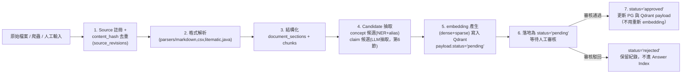
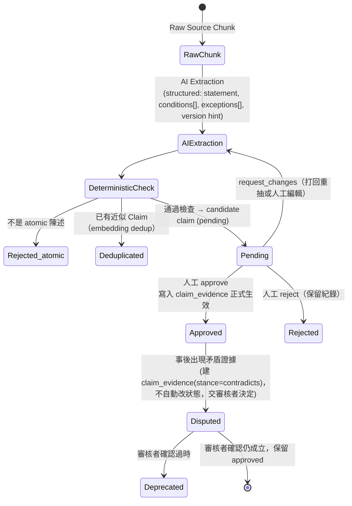

[索引](README.md) ｜ [← Qdrant 向量與 Payload 設計](02-qdrant-vector-design.md) ｜ [知識圖譜與檢索管線 →](04-knowledge-graph-and-retrieval.md)

---

## 5. Ingestion Pipeline

**白話說**：不管資料從哪裡來（爬蟲、人工上傳、既有 CSV），一律要走完下面七步才會出現在使用者看得到的答案裡；第 6 步「落地為 pending」是刻意的關卡——資料在還沒過人審之前，寧可讓系統知道「這筆資料存在但還不能用」，也不要讓它悄悄混進正式答案來源。



CSV/JSON 舊資料（`database.csv`, `database.json`, `Dictionary.txt`）遷移策略沿用 `KNOWLEDGE_SYSTEM_PLAN.md` 第 158-168 行既有分類，細節見下方 5.1。

### 5.1 現有 OpenST-QQBot 資產盤點與遷移對照

盤點對象是 `OpenST-QQBot` repo 裡 `public/database/` 的既有資料，以及 `src/services/` 裡可沿用的實作邏輯。原則：**能不經 Candidate 流程直接標記 approved 的資料要先遷，模糊品質的資料一律走 Candidate 流程，不因為「反正已經在生產環境用了」就跳過審核**。這份盤點對應 Phase 0（資料政策與盤點）與 MVP 第一個月 Implementation Order 第 1-4 步。

#### 5.1.1 分級總覽

| 分級 | 資產 | 可直接標記狀態 | 理由 |
| --- | --- | --- | --- |
| A. 直接遷移（skip Candidate） | `public/database/dictionary/entries/*.json` | `approved` | 已有 `status:"APPROVED"`、`threadURL` 來源、`references`/`referencedBy` 關係，等同人工審核過的 Verified Concept |
| A. 直接遷移 | `public/database/dictionary/zh-translations.json` | `approved` | 與上者 id 對應的正式中文翻譯 |
| A. 直接遷移 | `public/database/gtmc-database/**/*.md` | `approved`（文件本身）／chunk 內容仍需切段 | 結構化技術文件，非社群閒聊，品質等同已審核文件 |
| B. 結構遷移，內容待審 | `public/database/database.json` | `approved`（機器中繼資料）｜`pending`（tags→relations 的語意連結） | 機器名稱/作者/檔名等 metadata 無爭議，但 tags 對應到哪個 concept/mechanism 需要人工確認 |
| C. 走完整 Candidate 流程 | `public/database/database.csv` | `pending` | topic/content 品質落差大，無來源無版本，見 5.1.4 |
| C. 走完整 Candidate 流程 | `public/database/Dictionary.txt` | `pending` | 純人工中英對照，可能與 A 級詞典衝突，需 dedup |
| C. 走完整 Candidate 流程 | `public/database/TechMC Glossary.csv` | `pending` | 欄位需重新映射，且可能與 A 級詞典重複 |
| D. 邏輯可搬，資料為空 | `public/database/source/`（`src/services/source.ts` 讀取的目錄） | 不適用 | 目錄實際無內容，Code Intelligence 階段需重新取得 Minecraft 反編譯碼庫，`source.ts` 的檔案遍歷邏輯留待第13節 indexing pipeline 參考 |

#### 5.1.2 A級：`dictionary/entries/*.json` -> `concepts` + `concept_aliases` + `concept_translations` + `relations`

原始欄位對照：

| 原始欄位（`entries/{id}.json`） | 目標欄位 | 備註 |
| --- | --- | --- |
| `id`（Discord thread ID，如 `1454753442471084134`） | `sources.type='discord'` 下建一筆 `source_revisions`，`concepts` 另建自有 `id`，原 Discord id 存入 `concepts.external_ref` | 保留原 id 供 `referencedBy` 反查，見下方已知落差 |
| `terms[0]` | `concepts.canonical_name` | 第一個詞作正式名 |
| `terms[1:]` | `concept_aliases`（`alias_type='abbr'` 或 `'slang'`，依長度/大小寫啟發式判斷，人工可事後修正） | 例："Block Update Detector" + "BUD" |
| `definition` | 建一筆 `documents`(source=dictionary) + 一筆 `chunks`，並在 `claim_evidence`/`term_evidence` 建立 concept↔chunk 的證據關聯 | 定義全文本身當一手證據來源，不直接塞進 `concepts` 表（維持 3.9 節「文件與知識條目不可混為一談」原則） |
| `status:"APPROVED"` | `concepts.status='approved'` | 直接信任既有審核結果 |
| `threadURL` / `statusURL` | `sources.url` | 可追溯回 Discord 原討論串 |
| `references[]`（單向：本詞條引用了誰） | `relations(from=concept, RELATES_TO, to=concept)`，`review_status='approved'` | `matches` 欄位可存入 `relations.conditions` 供除錯 |
| `referencedBy[]`（如 `"AB003"`） | **暫不建立 relations**，先寫入 `concepts.external_ref_pending`（JSONB 陣列）保留原始值 | 見 5.1.5 已知落差：這批 ID 目前找不到對應資料表 |

匯入偽代碼（`ingestion/pipelines/dictionary.py`，已依 3.2/3.9 節 v2 修正更新為 document_revision + knowledge_objects 版本）：

```python
def migrate_dictionary_entries():
    zh_map = {e["id"]: e for e in load_json("zh-translations.json")["entries"]}
    for entry in iter_entry_files("dictionary/entries/*.json"):
        source_rev = register_source_revision(          # 寫入 source_revisions，raw_content_uri 指向本地 filesystem
            source_type="discord", url=entry["threadURL"], raw=entry)
        concept = upsert_concept(
            slug=slugify(entry["terms"][0]),
            canonical_name=entry["terms"][0],
            category="concept",           # 是 mechanism/effect/entity 由人工後續分類，第一版全塞 concept
            status="approved",
            external_ref=entry["id"])     # AFTER INSERT trigger 自動在 knowledge_objects 註冊
        for alias in entry["terms"][1:]:
            upsert_concept_alias(concept.id, alias, language="en",
                                  alias_type=guess_alias_type(alias))
        if entry["id"] in zh_map:
            zh = zh_map[entry["id"]]
            upsert_concept_alias(concept.id, zh["termsZh"], language="zh",
                                  alias_type="translation")
            insert_concept_translation(concept.id, "zh", zh["termsZh"], zh["definitionZh"])
        doc = insert_document(source_rev.source_id, title=entry["terms"][0], language="en")
        doc_rev = insert_document_revision(doc.id, source_rev.id, parser_version="dict-v1",
                                            status="approved")
        chunk = insert_chunk(doc_rev.section_root, content=entry["definition"])
        chunk_obj_id = get_knowledge_object_id("chunk", chunk.id)   # trigger 已建好，這裡查回 id
        insert_relation(from_object_id=get_knowledge_object_id("concept", concept.id),
                         relation_type="SUPPORTED_BY",
                         to_object_id=chunk_obj_id,
                         review_status="approved")
        for ref in entry.get("references", []):
            target = find_concept_by_term(ref["term"])
            if target:
                insert_relation(from_object_id=get_knowledge_object_id("concept", concept.id),
                                 relation_type="RELATES_TO",
                                 to_object_id=get_knowledge_object_id("concept", target.id),
                                 review_status="approved",
                                 conditions={"matched_text": ref["matches"]})
        # referencedBy 指向的外部編號目前無對應表，先保留原始值待 5.1.5 釐清
        update_concept_external_pending(concept.id, entry.get("referencedBy", []))
```

**這一步可作為 Implementation Order 的最快勝利**：979 筆詞條全部帶審核狀態與來源，預期 1-2 天可寫完 parser 並跑完全量匯入，直接產出 MVP 需要的 `concepts`/`concept_aliases` 種子資料，取代原計畫「人工建立 20-30 筆核心生電概念」（原第22節第8步）——用既有 979 筆取代人工建立，範圍更大且已有審核依據。

#### 5.1.3 A級：`gtmc-database/**/*.md` -> `documents` + `document_sections` + `chunks`

現有分類目錄（`BlockUpdate/`、`LoadingTicket/`、`EntityAI/`、`EntityMove/`、`Components&Features/`、`Appendix/`）本身就是主題分類，遷移規則：

| 規則 | 說明 |
| --- | --- |
| 目錄名 -> `documents.topic_tag`（新增欄位，非 3.2 節必要欄位，但利於後續按主題篩選） | 例：`BlockUpdate/02-连续的方块更新及其分析方法.md` -> topic_tag=`BlockUpdate` |
| 檔名數字前綴 -> `document_sections.order_index` | 維持原作者編排順序 |
| Markdown `#`~`######` -> `heading_path`（沿用 KNOWLEDGE_SYSTEM_PLAN.md 第172行既有切段規則，不重新設計） | |
| `img/` 子目錄 | 圖片先不遷移（MVP 不處理多模態），`chunks.content` 保留 `` 語法原文，Phase 2 再決定是否要建 `document_assets` |
| `404.md`（如 `EntityAI/404.md`）| 內容为空/占位文件，匯入時偵測並標記 `documents.status='rejected'`，不進 Answer Index | 避免空文件污染檢索結果 |
| license（`gtmc-database/LICENSE`） | 對應建一筆 `licenses` row，`sources.license` 指向它 | 3.10 節 licenses 表首次有實際資料可填 |

215 個檔案，`status` 建議統一設 `approved`（沿用 KNOWLEDGE_SYSTEM_PLAN.md 既有判斷：GTMC 文件為高可信度技術文件），唯獨偵測到的占位/空檔要擋下來。

#### 5.1.4 B/C級：`database.json`（機器）與 `database.csv`（社群知識）

**`database.json` -> `farms`**：欄位對照直觀（`name`/`author`/`description`/`filename` 直接映射，`tags` 拆成 `relations(farm, USES_MECHANISM/APPLIES_TO, concept)` 候選，因為單靠 tag 字串猜不出精準是哪個 concept，這部分建議 `pending`，由審核者在既有 979 筆 concept 種子中手動勾選對應）。`sub_id` 保留為 `farms.external_ref`，維持與現有 QQBot `/api/share?sub-xxxxx` 連結相容，未來若 QQBot 改接新系統的 API，分享連結不用變。

**`database.csv` -> Candidate Claim**：4287 行內品質差異很大，直接全量丟給 LLM 抽取成本高。分兩批處理：

1. **規則初篩**：沿用 `src/services/learn.ts` 的 `KNOWLEDGE_SHARING_PATTERNS`（「就是」「指的是」「定義為」等 15 個中文知識陳述關鍵詞）作為第一層 heuristic，命中的行優先送 AI Extraction，未命中的行（多半是純術語對照，如範例第13-15行 `Accessible,可访问的`）改走「詞典候選」而非「Claim 候選」，併入 5.1.2 的 alias 比對流程，不浪費 LLM 抽取成本在單純詞彙對照上。
2. **AI Extraction**：其餘進第6節標準 Candidate Claim workflow，`created_from_source_id` 指向 `database.csv` 對應行的 `source_revisions`（整份 CSV 當一個 source，每行存原始行號以便追溯）。

範例（`database.csv` 第7行「漏斗機制」）足夠 atomic 且資訊完整，人工審核成本低，是很好的 Phase 0 試跑樣本；第6行「大宗」這種純縮寫解釋則該落回 concept_aliases 而非 claim。

#### 5.1.5 已知落差：`referencedBy` 懸空引用

`dictionary/entries` 的 `referencedBy` 欄位（如 `1454753442471084134.json` 裡的 `"referencedBy": ["AB003","VBS002","TT001"]`）指向一個目前 repo 內找不到對應資料的外部編號系統，推測是原 Discord 審核系統裡機器/案例的正式編號庫，尚未同步進本 repo。**Phase 0 資料政策盤點必須先向資料原始維護者（Discord 審核團隊）確認這批 ID 對應到什麼**，否則：

- 若貿然建立 `relations` 指向不存在的實體，會違反第3.9節「應用層負責校驗 from_id/to_id 存在」的原則；
- 若略過不處理，會遺失「這個 concept 被哪些機器/案例引用」的重要反向索引，而這正是 Agent `find_producers_of_effect`/`expand_graph` 這類 tool 未來很依賴的資訊。

處理方式：先在 `concepts.external_ref_pending`（JSONB）原樣保留，Phase 1 若拿到對應資料表再回填為正式 `relations`；MVP 期間不阻塞，也不假裝這些引用已解析。

#### 5.1.6 可沿用的既有服務邏輯（非資料，是實作參考）

| 既有程式 | 可搬的部分 | 落地位置 | 不能照搬的原因 |
| --- | --- | --- | --- |
| [`src/services/embeddings.ts`](../src/services/embeddings.ts) | hf-mirror 鏡像源 + 本地代理偵測 + DNS fallback 的下載策略（國內網路環境已驗證可行） | `services/domain_model/inference.py` 或 ingestion 的 embedding 模組下載邏輯 | Node.js + `@xenova/transformers`，新系統用 Python + BGE-M3，模型物件與 pipeline API 不同，但「如何應對國內下載超時」這段運維經驗直接套用 |
| [`src/services/dictionary.ts`](../src/services/dictionary.ts) 的 `matchDictionaryTerms` | 中英雙向字串比對思路，可當 `resolve_alias()` tool 的 fallback（embedding 服務不可用時的降級路徑） | `services/tools/registry.py::resolve_alias` | 純 substring 比對無法處理語意相近但字面不同的別名，僅適合當 Phase 2 前的 MVP 簡化實作或降級 fallback |
| [`src/services/learn.ts`](../src/services/learn.ts) 的 `KNOWLEDGE_SHARING_PATTERNS` | 15 個中文知識陳述關鍵詞列表，作為 Candidate Claim 抽取前的粗篩規則 | `services/claims/extraction.py` 前置 filter | 原邏輯抽取後直接寫 CSV、無來源追溯、無審核，這部分整個不沿用，只取關鍵詞列表本身 |
| [`src/services/source.ts`](../src/services/source.ts) | 遞迴收集檔案 + 二進位副檔名判斷的通用邏輯 | Phase 2 `code_intel/indexer` 掃描原始碼樹時可參考同樣的跳過規則（`img/`、`.class`、`.jar` 等） | 目標目錄本身無內容，此為架構參考而非資料遷移 |
| [`src/services/search.ts`](../src/services/search.ts) | DuckDuckGo Lite 免費方案的請求/解析邏輯 | Phase 2+ 若要做「已審核來源政策下的網頁檢索」可參考 | 現行邏輯直接把搜尋摘要塞進 answer，違反新系統「未審核網頁爬取」延後的原則（第21節），只搬技術實作，不搬使用方式 |

---

## 6. Claim Extraction / Review Pipeline

**白話說**：這一節在回答「一句話從『AI 覺得這是個知識點』變成『系統敢拿去回答使用者』，中間要經過什麼關卡」。核心規則只有一條：AI 只能把候選送到審核者面前，**任何一個 Claim 要變成 approved，都要有一個真人按下 approve**，沒有例外，也沒有「信心分數夠高就自動通過」這種後門。



審核介面（Review Service）最小需求：一個 list+diff 頁面，顯示 candidate claim + 來源 chunk 原文 + 相似既有 claim，三個按鈕（approve/reject/request changes）。**MVP 可以就是一個內部網頁或甚至 CLI**，不需要做得漂亮。

---

