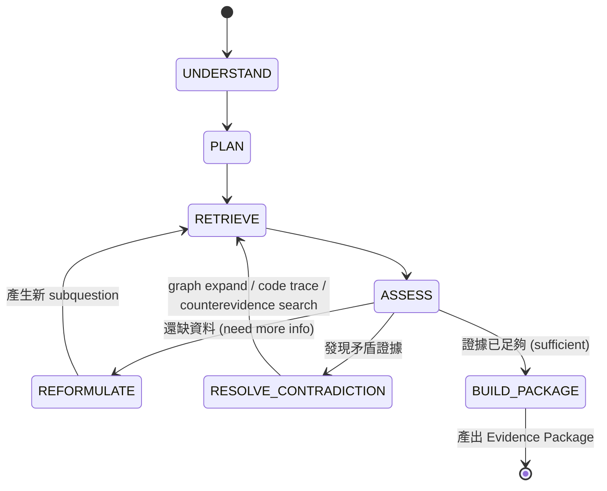

[索引](README.md) ｜ [← 知識圖譜與檢索管線](04-knowledge-graph-and-retrieval.md) ｜ [程式碼智能與多版本支援 →](06-code-intelligence-and-versioning.md)

---

## 9. Agent Research State Schema

**白話說**：`ResearchState` 是整個研究過程唯一的「筆記本」——Agent 每查一次資料、每想到一個假設、每發現一個矛盾，都要寫進這本筆記，下一輪決策只看筆記本，不能憑空記得「剛剛好像查過什麼」。這樣做的好處是任何一輪的決策都可以回頭重播、除錯，也是第24節「記錄真人研究軌跡」能夠訓練小模型的前提——如果狀態只存在 LLM 的對話上下文裡，事後沒辦法拿去分析「當時為什麼選了這個 tool」。

```python
class ResearchState(BaseModel):
    question: str
    query_type: Literal["definition","mechanism_explanation","causal",
                         "debugging","design","comparison",
                         "version_difference","code_analysis"]
    environment: dict            # {edition, version, loader}
    goal: str
    subquestions: list[str]
    hypotheses: list[Hypothesis]           # {statement, status: open|supported|rejected}
    known_facts: list[EvidenceRef]
    unknowns: list[str]
    candidate_concepts: list[int]
    candidate_mechanisms: list[int]
    candidate_claims: list[int]
    candidate_symbols: list[int]
    evidence: list[EvidenceRef]
    counterevidence: list[EvidenceRef]
    contradictions: list[Contradiction]
    visited_sources: set[str]
    visited_symbols: set[str]
    search_history: list[SearchRecord]     # {tool, args, result_ids, timestamp}
    remaining_budget: Budget               # {rounds, tool_calls, tokens, cost, seconds}
```

每輪 Agent 執行後的 state 更新規則：

1. 每次 tool 呼叫結果 append 到 `search_history`，去重後的候選 ID 併入對應 `candidate_*` 陣列。
2. **Hypothesis 生成/驗證流程（v2 修正）**：原設計「Hypothesis 只能由 Orchestrator 新增」矯枉過正——`design`/`causal` 類問題（例如「為什麼加了平台效率沒提高」）恰好需要 LLM 發散提出候選原因（mob cap saturation / transport bottleneck / spawn distribution / entity lifetime...），完全禁止 LLM 提假設會讓這類問題答不出來。正確分工是「LLM 能提議，不能直接寫 state」：
   ```text
   LLM.propose_hypotheses(research_state) -> list[CandidateHypothesis]
     -> Orchestrator 驗證：
          - dedup（與既有 hypotheses 語意相似度 > 閾值則合併，不重複塞）
          - schema 檢查（每條必須是可被證據支持/反駁的具體陳述，不可是開放式問題）
          - scope 檢查（提到的 concept/mechanism 必須能在 `concepts` 表解析，或明確標記 unresolved）
     -> 通過驗證的才寫入 ResearchState.hypotheses（status='open'）
   ```
   `CandidateHypothesis`（LLM 輸出，未進 state 前的暫存結構）：`{statement, related_concepts: list[str], rationale}`。只有 Orchestrator 驗證通過後才轉成正式 `Hypothesis`（`{statement, status: open|supported|rejected, evidence_refs}`），LLM 完全看不到、也不能直接修改 `ResearchState.hypotheses` 本身。
3. `unknowns` 每輪重新計算：依第12節 Evidence Requirement 尚未覆蓋的項目。
4. `remaining_budget` 每輪扣減，歸零觸發強制停止並進入「不完整證據」分支（見第19節 unknowns 欄位）。

State 整份持久化在 PG（預定 `research_sessions` 表，JSONB 欄位存 state snapshot 供除錯與 SFT 訓練資料萃取，第24節），不放記憶體易失。完整 DDL 由 `01` 統一定義，本篇不重複定義。

---

## 10. Agent Tool API

統一介面規範：所有 tool 是 pure function-like（輸入輸出皆 Pydantic model），內部才決定要打 Qdrant/PG/Code Intel 哪些後端，Agent 完全看不到後端組成。

> **白話說（為什麼 Agent 不能直接查資料庫）**：如果讓 Agent 自己組 SQL 或自己決定要查 Qdrant 還是 PG，等於讓一個研究助理自己決定要用哪種調查方法、甚至自己寫問卷——出錯風險高，而且每次要換檢索策略（例如把 dense-only 換成 hybrid）都要教會 Agent 新的操作方式。改成「Agent 只會說『我想查這個機制的限制條件』」（`get_mechanism_constraints`），至於這句話背後是查 Qdrant 還是 PG、要不要先做版本過濾，全部是工具內部的事，Agent 完全不用懂，也沒有機會因為自己拼錯 SQL 而查壞資料。

```python
class ToolResult(BaseModel):
    ok: bool
    data: list[dict] | dict | None
    error: str | None
    took_ms: int
    truncated: bool           # 是否因 budget 被截斷

# 範例（版本一律用 ID，不用字串比對；graph 先走 knowledge_objects 解析）
def search_effects(query: str, game_version_id: int | None = None,
                    edition: str = "java", top_k: int = 10) -> ToolResult: ...

def get_mechanism_constraints(mechanism_id: int) -> ToolResult: ...

def find_counterevidence(claim_id: int) -> ToolResult: ...

def expand_graph(knowledge_object_id: int,
                  relation_types: list[str] | None = None,
                  max_hops: int = 1) -> ToolResult: ...

def get_callers(symbol_id: int, code_version_id: int) -> ToolResult: ...
```

工具分組與後端對應：

| 分組 | Tools | 後端 |
| --- | --- | --- |
| Concept | `search_concepts`, `resolve_alias`, `get_related_concepts` | PG (concepts, aliases, relations) |
| Mechanism | `search_mechanisms`, `search_by_effect`, `search_by_application`, `get_mechanism_requirements`, `get_mechanism_constraints` | Qdrant named vector + PG join |
| Claim | `search_claims`, `get_claim`, `find_counterevidence`, `verify_claim_scope` | PG claims + claim_evidence |
| 通用檢索 | `semantic_search` [MVP]、`sparse_search` / `hybrid_search` [Phase 1]、`read_document_section` [MVP] | Qdrant + PG chunks |
| Graph | `expand_graph`, `find_path`, `find_producers_of_effect` [MVP 簡版，1 跳優先] | PG relations 遞迴查詢，先走 `knowledge_objects` 解析 |
| Code | `search_symbols`, `read_symbol`, `get_callers`, `get_callees`, `get_overrides`, `get_field_readers/writers`, `trace_control_flow`, `trace_data_flow`, `compare_versions`, `get_symbol_diff` [Phase 2，受控子迴圈，非自由 agent] | `code_symbols` + `code_annotations` + CodeQL/SCIP 查詢層；版本一律用 `code_version_id` / `game_version_id` |
| Experiment | `search_experiments`, `get_test_result` [MVP 只查已登錄]、`run_test` [Future] | experiments 表；`run_test` MVP 不實作（第17,21節） |
| Reasoning | `propose_hypotheses(research_state) -> list[CandidateHypothesis]` | **不是後端查詢 tool**，是 LLM 產出候選假設的呼叫點，回傳值不直接寫 state，必須經 Orchestrator 驗證（第9節），這是唯一允許 LLM「發散」的 tool，其餘 tool 一律是結構化查詢 |

**共通機制**：

- **Timeout**：每個 tool call 硬性 timeout（預設 5s，graph/code 類 10s），超時回傳 `ok=false, error="timeout"`，Orchestrator 視為一次失敗嘗試計入 budget。
- **Budget**：Orchestrator 在呼叫前檢查 `remaining_budget.tool_calls > 0`，用完直接拒絕呼叫並回傳結構化錯誤，不讓 LLM 自己判斷要不要停。
- **Caching**：以 `(tool_name, args_hash)` 為 key 做 LRU + TTL cache（同一 research session 內或跨 session 依 tool 決定 TTL；`search_claims` 等隨審核狀態變動的要短 TTL 或直接不跨 session 快取）。
- **Error handling**：所有 tool 錯誤回傳同一 `ToolResult` 形狀，Orchestrator 依 `ok`/`error` 決定重試、換 tool 或標記 unknown，不把 raw exception 丟給 LLM。

---

## 11. Agent State Machine（Multi-hop Retrieval Loop）

**白話說**：這不是「查一次資料就回答」，而是一個會反覆問自己「證據夠了嗎」的迴圈，最多繞 `max_rounds`（第12節）輪。ASSESS 是整個迴圈的分岔點，只有三種可能：還缺資料就回頭補問（REFORMULATE）、發現證據互相矛盾就先去解決矛盾（RESOLVE_CONTRADICTION）、或者證據真的夠了才收工（BUILD_PACKAGE）。



狀態說明：

| 狀態 | 動作 |
| --- | --- |
| UNDERSTAND | Query Understanding Service 輸出 query_type/entities/constraints，初始化 ResearchState |
| PLAN | 依 query_type 套用預定義 subquestion 模板（見下方範例），非自由生成；`design`/`causal` 類 query_type 在此狀態額外呼叫一次 `propose_hypotheses()`（第9-10節），驗證通過的假設併入 subquestion 骨架，讓後續 RETRIEVE 針對每個假設找支持/反駁證據 |
| RETRIEVE | 依 PLAN 選擇 tool 呼叫（可平行呼叫多個 tool） |
| ASSESS | 跑 Stop Condition checklist（第12節）；決定下一步 |
| REFORMULATE | 找出 unknowns 中最高優先項，生成新 subquestion，回到 RETRIEVE |
| RESOLVE_CONTRADICTION | 專門處理 `contradictions` 非空的情況：搜尋更多 counterevidence、比較 version_scope，必要時進 code trace |
| BUILD_PACKAGE | 產出 Evidence Package，State Machine 結束 |

第 11 節範例（豬布林農場問題）對應 PLAN 模板：`design` query_type 固定 subquestion 骨架 = `[目標效果的可能機制, 限制條件過濾, 機制的前置需求, 機制的已知限制, 相關 Claim 與其證據, 若涉及邏輯實作則程式驗證]`，Agent 在這個骨架上填內容，而不是自由決定要問什麼——這是「deterministic state machine 而非自由 agent」的具體實作方式，對應第27節的技術選型意圖。

**平行化**：同一狀態內若有多個獨立 subquestion（如「找機制」與「查詞典別名」），Orchestrator 可平行發 tool call，用 `asyncio.gather`，仍受 budget 總量限制。

---

## 12. Stop Conditions

**v2 修正**：原設計是全問題共用同一份 boolean checklist，且「每個 subquestion 有一筆 evidence」門檻太低——「這個 Java 行為到底怎麼運作」需要「1 verified claim + 1 code evidence」，「這個農場每小時真的有 100k」需要 experiment evidence，「BUD 是什麼」一篇可信文件就夠。共用門檻要嘛對簡單問題太嚴要嘛對難問題太鬆。

**修正**：每個 subquestion 帶自己的 `SubquestionRequirement`，PLAN 階段依 query_type + subquestion 類別從樣板表產生，不是全部問題共用一份：

```python
class SubquestionRequirement(BaseModel):
    subquestion_id: str
    required: bool = True
    minimum_evidence_count: int = 1
    minimum_quality: Literal["documented","expert_reviewed","measured","inferred","unverified"] = "documented"
    require_independent_sources: bool = False   # 是否要求 >=2 個不同 source_id 的證據
    require_direct_evidence: bool = True        # False 允許純推論型證據（inferred）頂替
    require_evidence_types: list[Literal["chunk","claim","code_symbol","experiment"]] = ["chunk","claim"]

class SufficiencyChecklist(BaseModel):
    per_subquestion: dict[str, bool]   # 每個 subquestion 是否達到自己的 SubquestionRequirement
    version_verified: bool             # environment.version 與所有 evidence 的 version_scope 相容（見4.3節整數比對）
    counterevidence_searched: bool     # find_counterevidence 對每個 critical claim 至少呼叫過一次
    all_hypotheses_resolved: bool      # 第9節驗證通過的 hypothesis 都已被支持或反駁，沒有 status=open 的殘留
```

**預設樣板**（`EVIDENCE_REQUIREMENT_TEMPLATES`，按 query_type 索引，可覆蓋個別 subquestion）：

| query_type | 預設 `minimum_quality` | 預設 `require_evidence_types` | 額外要求 |
| --- | --- | --- | --- |
| `definition` | `documented` | `["chunk"]` | 無 |
| `mechanism_explanation` | `expert_reviewed` | `["chunk","claim"]` | 若敘述涉及具體程式行為，額外要求一筆 `code_symbol` |
| `causal` / `design` | `expert_reviewed` | `["claim"]` | 每個經 `propose_hypotheses` 驗證通過的 hypothesis 都是一個獨立 subquestion，各自套用本列要求 |
| `debugging` | `expert_reviewed` | `["claim","code_symbol"]` | `require_independent_sources=True` |
| `version_difference` | `documented` | `["claim","code_symbol"]` | 要求證據橫跨 `version_from`/`version_to` 兩側各至少一筆 |
| `code_analysis` | `measured` | `["code_symbol"]` | 純程式行為問題不接受 `chunk`-only 證據 |
| 涉及具體量化宣稱（「每小時 100k」類） | `measured` | `["experiment"]` | 無 `experiment` 證據時，該 subquestion 永遠標記未覆蓋並進 `unknowns`，不允許用其他證據類型頂替（第17節：MVP 沒有 Test Runner，這類問題會誠實地在 Evidence Package 裡承認做不到） |

> **白話說（用第11節豬布林農場問題走一次）**：這題的 query_type 是 `design`，PLAN 階段拆出的 subquestion 之一是「有什麼機制能讓生物聚集但不用水流」。因為是 `design`，這個 subquestion 套用上表的 `causal/design` 列：`minimum_quality=expert_reviewed`、`require_evidence_types=["claim"]`。假設 Agent 只找到一篇未審核的社群討論（confidence=`unverified`）在講某個機制能聚怪，這個 subquestion 依然會被判定「未達標」（因為 unverified 低於 expert_reviewed 門檻），`per_subquestion` 裡這一項是 false，Agent 就不能直接收工，得繼續找有沒有 approved 的 Claim 佐證，或誠實承認這是 unknown。反過來，如果問的是「BUD 這個縮寫代表什麼」（`definition` 類），隨便一篇 `documented` 等級的詞典定義就達標，不需要繼續深挖。

全部 `per_subquestion` 為 true 且其餘三個欄位為 true 才進入 BUILD_PACKAGE；否則檢查硬限制：

```python
# 以下為初始猜測值，MVP 先量測 retrieval / LLM / verification latency、token、cost 後再定案
class Budget(BaseModel):
    max_rounds: int = 8
    max_tool_calls: int = 40
    max_tokens: int = 60000
    max_cost_usd: float = 0.50
    max_runtime_s: int = 90
```

任一硬限制觸發 → 強制進入 BUILD_PACKAGE，但 Evidence Package 的 `unknowns` 欄位如實列出未覆蓋的 checklist 項目，交給 Strong LLM 與 Final Verification 誠實反映不確定性，而不是假裝完整。

---

