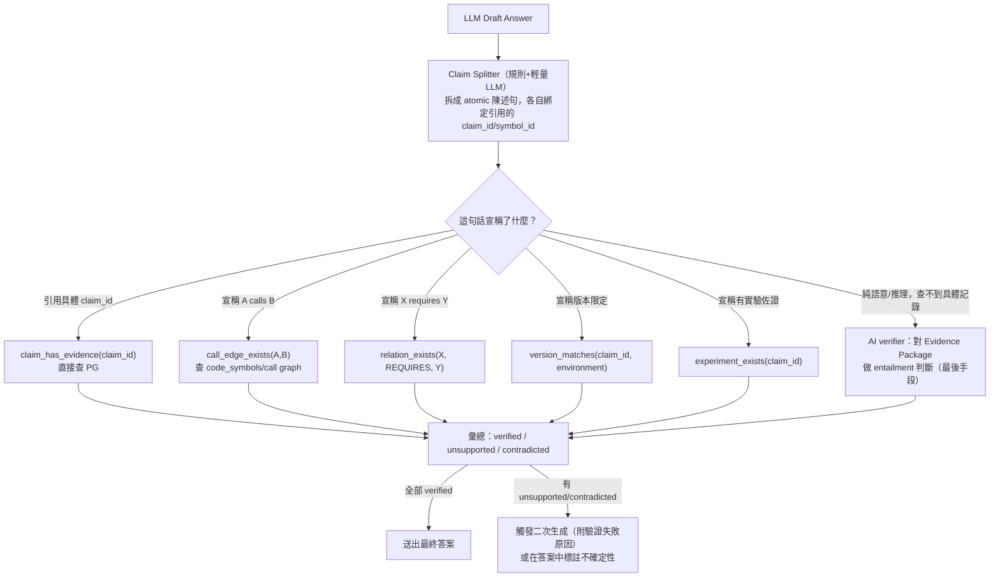

[索引](README.md) ｜ [← 程式碼智能與多版本支援](06-code-intelligence-and-versioning.md) ｜ [範圍界定與 MVP 定義 →](08-scope-and-mvp.md)

---

## 18. Evidence Workspace

職責：ResearchState 中不斷累積的 evidence，在放入 LLM prompt 前做**壓縮與去重**，這是防止 context 爆炸的關鍵模組。

> **白話說**：Agent 跑了 8 輪、呼叫了 40 次工具之後，`ResearchState.evidence` 裡可能塞了上百筆結果，但很多是同一件事的不同說法（同一份文件被不同 subquestion 各查到一次），也有不少是低品質、可有可無的旁證。Evidence Workspace 的工作就是在交給 LLM 之前先做一次「編輯審稿」：去掉重複的，把品質差的排到後面甚至丟掉，只留下 token 預算裝得下、且真正有代表性的那一批，讓 LLM 讀到的是精華筆記，不是研究過程中所有的雜訊。

```python
class EvidenceItem(BaseModel):
    id: str
    source_type: Literal["claim","chunk","code_symbol","experiment","relation"]
    source_id: int
    summary: str            # 精簡摘要，非全文
    full_ref: str            # 需要時可展開的引用（doc id + heading path 等）
    version_scope: dict
    confidence: str
    stance: Literal["supports","contradicts","neutral"]
    version_match: float     # 0~1，該證據的 version_scope 與 environment 目標版本的吻合程度
    source_authority: float  # 見下方 source authority 表
    directness: float        # 0~1，是否直接陳述問題所問的事，還是需要推論串接
    priority: float          # 見下方 EvidenceQuality 公式，取代 v1 的 relevance*confidence*recency

def compress(items: list[EvidenceItem], token_budget: int) -> list[EvidenceItem]:
    # 1. dedup: 同 source_id 或近似 summary（embedding sim > 0.95）只留最高 priority 一筆
    # 2. sort by priority desc
    # 3. greedy 填入直到 token_budget 用盡，優先保留 supports + contradicts 各至少一筆／critical claim
```

**v2 修正（Evidence Quality 公式）**：原公式用 `relevance × confidence × recency`，但 `recency`（新舊）對 Minecraft 技術知識是錯誤的通用指標——2020 年寫的 1.16.1 原始碼分析，不會因為「舊」就比一篇 2025 年但寫錯版本的文章差。拿掉 `recency`，換成真正決定證據可信度的因素：

```text
EvidenceQuality = retrieval_relevance × version_match × source_authority × directness × verification_weight
```

- **`retrieval_relevance`**：tool 呼叫時的檢索分數（RRF/rerank 分數正規化到 0~1）。
- **`version_match`**：該證據 `version_scope` 是否精確涵蓋 environment 目標版本（4.3節整數比對，1.0=精確涵蓋，按版本距離遞減，不相容則整條證據不進候選，不是壓低分數）。
- **`source_authority`**：由證據型別決定的預設權重表（非永恆規則，見下方按 Claim 類型調整）：

  | 證據型別 | 預設 authority |
  | --- | --- |
  | 原始碼直接證據 / 可重現實驗結果 | 1.0 |
  | Expert-reviewed 技術文件（如 gtmc-database） | 0.85 |
  | 官方文件 / Wiki | 0.7 |
  | 社群討論（如已審核的 dictionary entry） | 0.55 |
  | AI 推論（未經人工審核的 candidate） | 0.3 |

- **`directness`**：證據是否直接回答 subquestion，還是要經過額外推論鏈才連得上（人工標註或由 Claim Extraction 階段的 AI 抽取信心分數帶出）。
- **`verification_weight`**：`review_status='approved'` 為 1.0，`pending` 打七折，`disputed` 打三折，`rejected` 直接排除不進 workspace。

**這個公式本身不是寫死的全域常數**：不同 `query_type`/Claim 類型可以覆蓋 `source_authority` 表（例如 `debugging` 類問題應該把 code evidence 的權重拉得比一般問題更高），實作上把上表當作 per-query_type 可覆蓋的 policy，不是硬編碼進 `compress()` 函式本體。

- **Deduplication**：優先用 `source_id` 精確去重，其次用 summary embedding 相似度。
- **Token budget**：Evidence Workspace 對「進 LLM 的量」設獨立 budget（與 tool call budget 分開管理），例如固定 8K tokens 給證據區塊，超出時只保留摘要 + full_ref，讓 Strong LLM 需要時才顯式要求展開（可設計成 Strong LLM 也能呼叫 `read_document_section` 一次，但次數受限）。

---

## 19. Evidence Package Schema

```python
class EvidencePackage(BaseModel):
    question: str
    environment: dict
    verified_claims: list[ClaimRef]      # review_status=approved
    candidate_claims: list[ClaimRef]      # 明確標記未審核
    mechanisms: list[MechanismRef]
    constraints: list[ConstraintRef]
    execution_paths: list[CodePathRef]    # call graph 摘要，非原始碼全文
    counterevidence: list[EvidenceRef]
    experiments: list[ExperimentRef]
    unknowns: list[str]                   # 明確列出未覆蓋項目，來自第12節 checklist
    source_snippets: list[SourceSnippet]  # 少量必要原文引用，附出處
    sufficiency: SufficiencyChecklist     # 附上第12節 checklist 結果，讓 LLM/使用者知道信心邊界
```

Prompt 組裝規則：`verified_claims` 與 `candidate_claims` **視覺上與語意上都要分開呈現**（不同段落，明確標籤），系統 prompt 明確指示 Strong LLM「不可將 candidate_claims 當作已驗證事實」，並要求輸出時援引 `claim_id`/`source_snippet.id`，這是第20節 Final Claim Verification 能自動比對的前提。

> **白話說**：這份 Evidence Package 就是館員（Orchestrator）交給撰稿人（Strong LLM）的研究筆記，格式明確規定「哪些是查證過的事實」「哪些只是還沒證實的線索」「哪些地方查不到資料」都要分開列，而不是揉成一段連續的文字敘述交出去——這樣撰稿人才不會不小心把「有人在論壇這樣講」寫成「已驗證這樣運作」，讀者也才能一眼看出這份分析報告的信心邊界在哪裡。

---

## 20. Final Claim Verification

**白話說**：這是整個系統最後一道防線——LLM 寫完答案之後，還要把答案「拆句」，逐句反查資料庫核對是不是真的說得出證據，而不是寫完就直接送出去。能用資料庫查證的，優先用查的（快、準確、不會被文字表面說服），只有真的查不出來、屬於語意推論的句子，才讓另一個 AI 去判斷合不合理。



**設計要點**：deterministic 檢查一律優先於 AI verifier，AI verifier 只處理「陳述句本身無法對應資料庫具體記錄，但需要判斷是否被證據語意涵蓋」的剩餘案例，把 AI 判斷的比例壓到最低，這樣整個系統的可信度才立得住。

---

